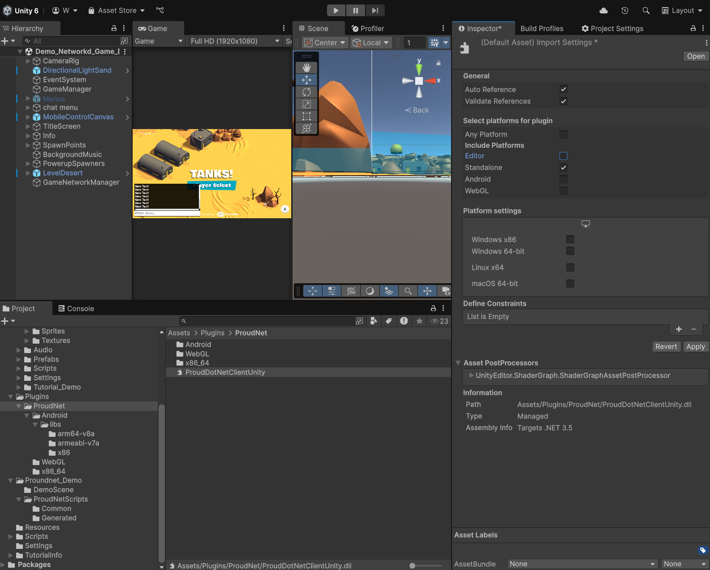

# Tank Game Unity Client Project

A multiplayer tank game Unity client implementation using ProudNet networking library, built upon Unity's official tank tutorial template with enhanced multiplayer and chat functionality.

## Prerequisites

Before building this Unity client project, you must have completed the **Tank Server Setup** from the previous documentation and have the following components installed.

### Required Directory Structure
```
project_root/
├── tank_server/          # Server project (from previous setup)
│   ├── Common/
│   ├── Server/
│   ├── Client/
│   └── Server_CPP/
├── ProudNet/            # Required: Files from ProudNet installation
│   ├── doc/
│   ├── include/
│   ├── lib/
│   ├── Sample/
│   └── util/
└── tank_unity_client/   # This Unity project (to be created)
    ├── Assets/
    ├── Packages/
    └── ProjectSettings/
```

### Required Software Installation
1. **Unity Hub** and **Unity Editor** (2021.3 LTS or newer recommended)
2. **ProudNet Unity Tank Client Sample Package** - Available from GitHub at https://github.com/Nettention/proudnet_sample_tank_server/releases/tag/0.99
3. **Completed Tank Server** - From the previous server setup documentation

### ProudNet Unity Tank Client Sample Package Location
The ProudNet Unity Tank Client Sample Package can be downloaded from:
```
https://github.com/Nettention/proudnet_sample_tank_server/releases/tag/0.99
File: tank_unity_client_proudnet_sample.unitypackage
```

## Project Structure

### 🎮 Unity Project Assets
Contains Unity-specific game assets and ProudNet integration components.

**Contents:**
- **Tank Template** - Unity's official tank tutorial project (single-player base)
- **ProudNet Integration** - Networking scripts and DLL plugins
- **Multiplayer Scripts** - Enhanced tank game logic with network synchronization
- **Chat System** - P2P messaging functionality
- **Network Manager** - Server connection and P2P group management

**Key Components:**
- `Plugins/` - ProudNet DLL files for Unity
- `Scripts/Network/` - ProudNet integration scripts
- `Proudnet_Demo/` - Sample game scenes with multiplayer support


### 🌐 Network Features
Unity client implementation with ProudNet networking.

**Features:**
- Real-time multiplayer tank game client
- Tank movement, firing, and health synchronization
- P2P group participation for efficient networking
- In-game chat system with P2P messaging
- Server connection management
- Cross-platform compatibility (Windows, Mac, Linux builds)

**Supported Platforms:**
- **Windows Standalone** - Desktop application
- **Mac Standalone** - macOS application  
- **Linux Standalone** - Linux application
- **WebGL** - Web browser deployment (via WebSocket)

### 🔄 Protocol Compatibility
Uses identical protocol definitions from the tank server project.

**Shared Components:**
- **Same Tank.PIDL** - Identical RMI function definitions
- **Compatible Message Format** - Same network protocol as C# and C++ servers
- **Synchronized Game Logic** - Movement, firing, and health systems match server implementation

## Development Notes

- Unity version: 2021.3 LTS or newer recommended
- ProudNet Unity package provides native DLL integration
- Compatible with all tank server implementations (C# and C++)
- WebGL builds use WebSocket transport for web browser compatibility
- Desktop builds use TCP transport for optimal performance

## Getting Started

### Prerequisites Verification
Before starting, ensure you have:
1. **Completed Tank Server Setup** - Follow the server documentation to set up either C# or C++ server
2. **Running Tank Server** - Have a tank server running and accessible
3. **ProudNet Installation** - ProudNet folder with Unity package available
4. **Unity Hub and Editor** - Unity 2021.3 LTS or newer installed

### 1. Unity Project Creation and Setup

#### Step 1: Create New Unity Project
Create a new Unity project for the tank client:

**Using Unity Hub:**
1. Open **Unity Hub**
2. Click **"New Project"**
3. Select **"3D"** template
4. Set **Project Name**: `Tank Unity Client`
5. Set **Location**: `project_root/tank_unity_client/`
6. Click **"Create project"**

**Expected Project Structure:**
```
tank_unity_client/
├── Assets/
├── Packages/
├── ProjectSettings/
└── UserSettings/
```

#### Step 2: Import Unity Tank Template
Import Unity's official tank tutorial project as the base template:

**Via Unity Asset Store:**
1. Open **Window > Asset Store** in Unity Editor
2. Search for **"Tanks! Complete Project"**
3. Navigate to: https://assetstore.unity.com/packages/essentials/tutorial-projects/tanks-complete-project-46209
4. Click **"Add to My Assets"** (if not already owned)
5. In Unity Editor, open **Window > Package Manager**
6. Select **"My Assets"** from dropdown
7. Find **"Tanks! Complete Project"**
8. Click **"Download"** then **"Import"**

**Import Options:**
- Select **"All"** to import complete project
- Click **"Import"** to add all tank game assets


*Unity Tank Complete Project import dialog - Select "All" and click "Import" to add the complete tank game template*

#### Step 3: Test Single-Player Template
Verify the imported tank template works correctly:

1. **Open Main Scene**: Navigate to `unity_tank_client\Assets\_Tanks\Tutorial_Demo\Demo_Scenes\Demo_Game_Desert.unity`


*Unity Tank Demo Scene - The original single-player tank game scene after importing the complete project*

2. **Enter Play Mode**: Click the **Play** button in Unity Editor
3. **Test Controls**: 
   - **WASD**: Move tank
   - **Space**: Hold to charge shot power, release to fire shells

**Expected Single-Player Behavior:**
- Tank moves smoothly with WASD controls
- Cannon aims toward mouse position
- Shells fire and create explosions on impact
- Tank health decreases when hit by shells
- Game ends when tank health reaches zero

### 2. ProudNet Unity Integration

#### Step 1: Import ProudNet Unity Tank Client Sample Package
Import the ProudNet Unity Tank Client Sample Package to add networking capabilities:


**Expected Package File:**
```
tank_unity_client_proudnet_sample.unitypackage
```

**Import Package in Unity:**
1. Download `tank_unity_client_proudnet_sample.unitypackage` from the GitHub release
2. In Unity Editor, go to **Assets > Import Package > Custom Package...**
3. Navigate to the downloaded `tank_unity_client_proudnet_sample.unitypackage`
4. Select the package file and click **"Open"**
5. In the import dialog, select **"All"** to import all components
6. Click **"Import"** to add ProudNet to the project


*ProudNet Unity Tank Client Sample Package import dialog - Select "All" and click "Import" to add ProudNet networking components*


#### Step 2: Verify ProudNet Installation
Check that ProudNet components are properly integrated:

**Sample Assets Installation Verification:**
1. Verify the following folder structure exists:
   ```
   Assets/
   ├── Plugins/
   │   └── ProudNet/           # Contains ProudNet DLLs
   │       ├── ProudNetClientUnity.dll
   │       ├── Andorid/
   │       ├── WebGL/
   │       └── x86_64/
   ├── ProudNet_Demo/          # Demo scene and scripts
   │   ├── DemoScene/
   │   └── ProudNetScripts/
   └── Scripts/
       └── Network/            # Network-related scripts
   ```

**Platform Settings Verification:**
1. Select each DLL in `Assets/Plugins/`
2. In Inspector, verify **Platform settings**:
   - **Windows**: Enabled for x86_64 (Standalone Windows)
   
#### Step 3: Configure Network Settings
Set up basic network configuration for tank game:

**Create Network Configuration:**
1. Right-click in Project window
2. Select **Create > ProudNet > Network Config**
3. Name it `TankNetworkConfig`
4. Configure the following settings:
   - **Server IP**: `127.0.0.1` (localhost for testing)
   - **Server Port**: `33334` (matches tank server port)
   
**Network Configuration Details:**
TankNetworkConfig Connection Settings:
- Server IP: 127.0.0.1
- TCP Port: 33334 (for standalone builds)
- WebSocket Port: 33335 (for WebGL builds, only supported by C++ server)

Note: We will use port 33334 for standalone builds initially. Later for WebGL builds, we'll use the WebSocket port 33335 which is only available in the C++ server implementation (the C# server does not support WebSocket connections).

### 2.5. PIDL Integration Workflow (Optional but Recommended)

If you completed the server setup from the previous documentation, you can reuse the generated PIDL files:

**Option A: Copy from Server Project (Recommended)**
If you have the tank server project available, use the convenience batch script:

```bash
# Navigate to tank_server directory
cd tank_server

# Run the copy script
copy_client_generated_to_unity.bat
```

**What the script does:**
```
Copies from tank_server/:
├── Server/Tank_stub.cs     → unity_tank_client/Assets/Proundnet_Demo/ProudNetScripts/Generated/
├── Server/Tank_proxy.cs    → unity_tank_client/Assets/Proundnet_Demo/ProudNetScripts/Generated/
├── Server/Tank_common.cs   → unity_tank_client/Assets/Proundnet_Demo/ProudNetScripts/Generated/
└── Common/Vars.cs          → unity_tank_client/Assets/Proundnet_Demo/ProudNetScripts/Common/
```

**Expected Output:**
```
===== ProudNet Generated Files Unity Copy Script =====
Copying PIDL generated files...
        1 file(s) copied.
        1 file(s) copied.
        1 file(s) copied.
Copying common files...
        1 file(s) copied.

Copy completed! The following files have been copied to Unity project:
- ..\unity_tank_client\Assets\Proundnet_Demo\ProudNetScripts\Generated\Tank_stub.cs
- ..\unity_tank_client\Assets\Proundnet_Demo\ProudNetScripts\Generated\Tank_proxy.cs
- ..\unity_tank_client\Assets\Proundnet_Demo\ProudNetScripts\Generated\Tank_common.cs
- ..\unity_tank_client\Assets\Proundnet_Demo\ProudNetScripts\Common\Vars.cs

Press any key to continue...
```

**Option B: Manual PIDL Generation (If no server project)**
If you don't have the server project, you would need to:
1. Have access to the `Tank.PIDL` file from the Common folder
2. Run `ProudNet/util/PIDL.exe -cs Tank.PIDL -outdir Generated`
3. Manually copy the generated files to the Unity directories

**Protocol Compatibility Benefits:**
- **Identical Message IDs**: Unity client uses same RMI IDs as server
- **Type Safety**: Compile-time checking of network message parameters  
- **Version Synchronization**: Protocol version automatically matches server
- **Zero Configuration**: No additional network setup required

### 3. Tank Multiplayer Integration

#### Step 1: Network Scripts Overview
The tank Unity client uses a comprehensive networking system built on ProudNet RMI (Remote Method Invocation). Here's the actual script structure:

**Core Network Scripts:**
```
Assets/
├── Scripts/Network/
│   ├── GameNetworkManager.cs     # Main network manager (Singleton)
│   └── NetworkTank.cs           # Individual tank network synchronization
├── Proundnet_Demo/ProudNetScripts/
│   ├── Common/
│   │   └── Vars.cs              # Protocol version and server configuration
│   └── Generated/               # Auto-generated from Tank.PIDL
│       ├── Tank_common.cs       # RMI message IDs and constants
│       ├── Tank_proxy.cs        # Client-to-server RMI calls
│       └── Tank_stub.cs         # Server-to-client RMI handlers
```

**GameNetworkManager.cs - Main Features:**
- **Server Connection Management**: Handles connection to tank server (TCP/WebSocket)
- **P2P Group Management**: Manages peer-to-peer communication groups
- **Tank Lifecycle**: Spawns/destroys local and remote tanks
- **RMI Communication**: Sends/receives tank movement, firing, health updates
- **Chat System**: P2P messaging with other players
- **Multi-platform Support**: Automatic TCP (standalone) vs WebSocket (WebGL) selection

**NetworkTank.cs - Individual Tank Features:**
- **Position Interpolation**: Smooth movement sync for remote tanks  
- **Local Player Control**: WASD movement and firing for your tank
- **Remote Player Rendering**: Displays other players' tanks with network data
- **Health Synchronization**: Real-time health updates across all clients
- **Projectile Sync**: Handles shell firing and impact effects
- **Collision Detection**: Tracks damage from shell explosions

**Generated RMI Classes (from Tank.PIDL):**
- **Tank_proxy.cs**: Methods to send data to server (`SendMove`, `SendFire`, `SendTankHealthUpdated`)
- **Tank_stub.cs**: Handlers to receive data from server (`OnTankPositionUpdated`, `OnSpawnBullet`, `OnPlayerJoined`)
- **Tank_common.cs**: Message IDs and RMI constants shared between client and server

**Important Note:** The files in `Generated/` folder are the **exact same files** generated during the C# server implementation in the previous documentation. This ensures 100% protocol compatibility between the server and Unity client. The Unity client reuses the identical PIDL-generated networking code.

**Key Network Features Implemented:**
- **Real-time Movement Sync**: 20Hz position updates with interpolation
- **Projectile Synchronization**: Shells fired by other players appear instantly
- **Health Management**: Damage and healing synchronized across all clients  
- **P2P Chat System**: Direct messaging between players in the same group
- **Tank Type Selection**: Different tank models synchronized across clients
- **Automatic Reconnection**: Handles network disconnection gracefully

#### Step 2: Open Pre-configured Multiplayer Scene
The Unity tank client includes a pre-configured multiplayer scene with ProudNet integration:

**Open the Network-Ready Scene:**
1. Navigate to `Assets\Proundnet_Demo\DemoScene\`
2. Open `Demo_Networkd_Game_Desert.unity` scene
3. This scene is **already configured** with all necessary networking components


*ProudNet Network Demo Scene - The pre-configured multiplayer tank game scene with networking components and chat system*


#### Step 3: Verify Network Configuration (Optional)
The scene is pre-configured, but you can verify or modify the network settings if needed:

**GameNetworkManager Settings (Already Configured):**
1. Select **GameNetworkManager** GameObject in hierarchy
2. In Inspector, view **GameNetworkManager** component settings:
   - **Server IP**: `127.0.0.1` (localhost for testing)
   - **Server Port**: `33334` (TCP for standalone builds)
   - **WebSocket Port**: `33335` (for WebGL builds only) [Note: This setting is hidden in the inspector for standalone builds but will be used later when building for WebGL]
   - **Auto Connect On Start**: Enabled for automatic connection


*GameNetworkManager Inspector - Network configuration settings for server IP, port, and connection options*


**Customization Options:**
- **Server IP**: Change if your server runs on a different machine
- **Ports**: Modify if your server uses different ports
- **Auto Connect**: Disable if you want manual connection control

### 4. Testing Multiplayer Functionality

#### Step 1: Start Tank Server
Before testing the Unity client, ensure your tank server is running:

**C++ Server**
```bash
cd tank_server/Server_CPP
run.bat
```

**Expected Server Output:**
```
========== Tank Server Started ==========
TCP Server listening on 0.0.0.0:33334
WebSocket Server listening on 0.0.0.0:33335/ws
Ready to accept connections from all network interfaces
==========================================
Server is running. Commands:
status: Show connected clients
```

#### Step 2: Test Unity Client Connection
Test the Unity client connection to the tank server:

**Unity Editor Testing:**

1. Click **Play** button in Unity Editor
2. Observe connection status in Unity Console and Game view


*Unity Game Initial Screen - The game view after clicking Play button showing tank spawning and ProudNet connection status*


**Expected Server Response:**
```
Client connected: Host ID = 6
New tank created for client 6 with tank type -1 and health 100.000000/100.000000
Not enough clients to create P2P group (need at least 2)
========== SendTankType Received ==========
From client 6: tankType=-1
========== SendTankType Processing Completed ==========
```

**Unity Game View:**
- **Connection Status**: "Connected to Server" indicator
- **Tank Selection**: Choose from 4 available tank types to spawn
- **Player Tank**: Your selected tank spawns in the game world
- **Chat Interface**: Press Enter to open chat window for P2P messaging
- **Tank Controls**: WASD movement, mouse aiming, click/space firing

#### Step 3: Multi-Client Testing
Test multiplayer functionality with multiple Unity clients:

**Second Unity Instance:**
1. **Build Unity Project**: Go to **File > Build and Run**
2. **Configure Build Settings**:
   - **Target Platform**: PC, Mac & Linux Standalone
   - **Architecture**: x86_64
   - **Scenes**: Add `Demo_Networkd_Game_Desert.unity` scene


*Windows Standalone Build Settings - Configure platform, architecture, and scene list for desktop build*

3. **Build**: Click "Build and Run" to create standalone executable
4. **Run Standalone**: This creates a second client instance. After successful build, you can run the game directly from the build location (e.g., `Build/unity_tank_client.exe`)


*Build Completed - The generated executable files and build output in the target directory*

**Alternative Testing Method:**
- **ParrelSync** (Unity Asset): Allows multiple Unity Editor instances
- **Clone Project**: Create project clone for simultaneous testing


*Multi-Client Gameplay - Two clients connected and playing together with synchronized tanks, movement, and P2P chat system*

**Expected Multi-Client Behavior:**
```
Unity Client 1 (Editor):
[ProudNet] Connected to server successfully
[ProudNet] Assigned Client ID: 6
[P2P] Other player joined: Client ID 7
[TankGame] Tank Type Selected: 1 (health: 225)
[TankGame] Remote tank spawned for player 7 (Type: 0, health: 150)

Unity Client 2 (Standalone):
[ProudNet] Connected to server successfully  
[ProudNet] Assigned Client ID: 7
[P2P] Other player joined: Client ID 6
[TankGame] Tank Type Selected: 0 (health: 150)  
[TankGame] Remote tank spawned for player 6 (Type: 1, health: 225)
```

**Server Log with Multiple Clients:**
```
Client connected: Host ID = 6
New tank created for client 6 with tank type -1 and health 100.000000/100.000000
Not enough clients to create P2P group (need at least 2)
Client connected: Host ID = 7
New tank created for client 7 with tank type -1 and health 100.000000/100.000000
Sending existing player info to new client: ID=6, Type=-1, Health=100.000000/100.000000
P2P group created with 2 members, Group ID: 8

========== Tank Selection and Spawning ==========
========== SendTankSpawned Received ==========
From client 6: position=(20.959999,11.930000), direction=212.665558, tankType=1, health=225.000000
Tank spawned for client 6 at (20.959999,11.930000)
========== SendTankSpawned Received ==========
From client 7: position=(20.959999,11.930000), direction=212.665558, tankType=0, health=150.000000
Tank spawned for client 7 at (20.959999,11.930000)
```

### 5. Multiplayer Features Testing

#### Movement Synchronization Testing
Test real-time tank movement across multiple clients:

**Client 1 Actions:**
- Use **WASD** to move tank around the map
- Observe smooth movement in local client

**Client 2 Observations:**  
- See Client 1's tank moving in real-time
- Movement is smooth and synchronized
- Position updates occur at 20Hz (configurable)

**Expected Network Messages:**
```
Client 1 → Server: SendMove(posX: 15.2, posY: 30.1, direction: 45)
Server → Client 2: OnTankPositionUpdated(clientId: 3, posX: 15.2, posY: 30.1, direction: 45)
```

#### Firing and Projectile Testing
Test shell firing synchronization:

**Client 1 Actions:**
- Aim with **mouse** toward target
- Click **left mouse button** or press **space** to fire

**Client 2 Observations:**
- See shell spawn from Client 1's tank
- Shell trajectory follows physics accurately
- Explosion effects occur at impact location
- Health decreases if shell hits Client 2's tank

**Expected Network Messages:**
```
Client 1 → Server: SendFire(shooterId: 3, direction: 180, launchForce: 25, posX: 15.2, posY: 30.1)
Server → Client 2: OnSpawnBullet(clientId: 3, shooterId: 3, direction: 180, force: 25, ...)
Server → All: OnTankHealthUpdated(clientId: 4, health: 85, maxHealth: 100)
```

#### P2P Chat System Testing
Test real-time messaging between players:

**Client 1 Actions:**
- Click **chat input field** at bottom of screen
- Type message: `"Hello from Client 1!"`
- Press **Enter** to send

**Client 2 Observations:**
- Message appears in chat log: `"Player: Hello from Client 1!"`
- Chat log scrolls automatically
- Message timestamp is displayed


#### Health and Damage Testing
Test health synchronization and damage effects:

**Damage Scenario:**
- Client 1 fires shell at Client 2's tank
- Shell hits and causes damage

**Expected Results:**
- **Client 2**: Health decreases (e.g., 100 → 75)
- **Client 1**: Sees Client 2's health update
- **Health UI**: Both clients show updated health values
- **Visual Effects**: Damage effects and particles displayed


### 6. WebGL Deployment (Optional)

#### WebGL Build Configuration
Deploy the Unity tank client as a web application:

**Build Settings:**
1. Go to **File > Build Settings**
2. Select **WebGL** platform
3. Click **"Switch Platform"**
4. **Add Scenes**: Ensure `Demo_Networkd_Game_Desert.unity` is included


*WebGL Build Settings - Configure WebGL platform with proper scene list and build options for web deployment*

5. **Configure ProudNet Plugin Settings** (Important!)
6. **Configure WebGL Player Settings** (Important!)

#### ProudNet Plugin Configuration for WebGL
After switching to WebGL platform, you must configure ProudNet plugin settings:

> ⚠️ **Important WebGL Limitation**: ProudNet does not support in-editor play mode when the WebGL platform is selected. You must build and deploy the WebGL version to test networking functionality. Editor play mode will not work for network testing on WebGL platform.

**Step 1: Disable Editor for .NET DLL**
1. Navigate to `Assets/Plugins/ProudNet/`
2. Select `ProudDotNetClientUnity.dll`
3. In Inspector → **Platform settings**:
   - **Editor**: ❌ (unchecked)


*ProudNet .NET DLL Platform Settings - Disable Editor checkbox for ProudDotNetClientUnity.dll when using WebGL platform* 
   
**Step 2: Disable Editor for x86_64 DLLs**
1. Navigate to `Assets/Plugins/ProudNet/x86_64/`
2. Select `ProudNetClient.dll`:
   - **Editor**: ❌ (unchecked)
   
3. Select `ProudNetClientPlugin.dll`:
   - **Editor**: ❌ (unchecked)


*ProudNet x86_64 DLL Platform Settings - Disable Editor checkbox for x86_64 DLLs when using WebGL platform*
   

**Step 3: Enable Editor for WebGL Files**
1. Navigate to `Assets/Plugins/ProudNet/WebGL/`
2. Select `JSClient.jslib`:
   - **Editor**: ✓ (checked)
   - **WebGL**: ✓ (checked)
3. Select `NewJSClient.jslib`:
   - **Editor**: ✓ (checked)
   - **WebGL**: ✓ (checked)
4. Select `ProudNetClientPlugin-webgl.dll`:
   - **Editor**: ✓ (checked)
   - **WebGL**: ✓ (checked)


*ProudNet WebGL Files Platform Settings - Enable Editor and WebGL checkboxes for WebGL-specific files*

> ⚠️ **Critical**: If these settings are not configured correctly, the WebGL build will fail or the networking will not function properly.

#### WebGL Player Settings Configuration
Configure Unity's WebGL-specific settings for optimal local testing:

**Publishing Settings (Critical for Local Testing):**
1. Go to **Edit > Project Settings > Player > WebGL Settings**
2. Expand **Publishing Settings** section
3. Set **Compression Format**: **Disabled**
   - This is essential for local web server testing
   - Compressed builds may not work with simple HTTP servers
   - Can be re-enabled for production deployment


*WebGL Publishing Settings - Set Compression Format to "Disabled" for local testing compatibility*

**Recommended WebGL Settings:**
```
Publishing Settings:
├── Compression Format: Disabled (for local testing)
├── Name Files As Hashes: ❌ (unchecked)
├── Data Caching: ❌ (unchecked)  
├── Debug Symbols: Off
└── Power Preference: High Performance

Memory Settings:
├── Initial Memory Size (MB): 32
├── Maximum Memory Size (MB): 2048
├── Memory Growth Mode: Geometric
└── Geometric Memory Growth Cap (MB): 96
```

> 💡 **Tip**: For production deployment, you can enable **Gzip** compression format to reduce download sizes, but disable it for local testing to avoid server compatibility issues.

**Network Configuration for WebGL:**
- **Transport**: WebSocket (automatically used for WebGL)
- **Server URL**: `ws://localhost:33335/ws` (local testing)
- **Production URL**: `ws://your-server.com:33335/ws`


*WebGL Network Configuration - GameNetworkManager showing WebSocket port and base URI settings for WebGL platform*

#### WebGL Testing
Test the web version of the tank client:

> 📝 **Note**: Remember that ProudNet networking does not function in Unity Editor play mode when WebGL platform is selected. You must complete the full build process to test networking features.

**Build Process:**
1. Click **"Build"** in Build Settings
2. Create or select any folder for output folder : eg- `WebGL_Build/`
3. Wait for build completion (may take several minutes)

**Local Web Server Setup:**
> ⚠️ **Important**: WebGL builds must be hosted on a web server and cannot be played by directly opening the HTML file locally.

**Method 1: Python HTTP Server**
```bash
# Navigate to WebGL build folder
cd WebGL_Build/

# Python 3 (recommended)
python -m http.server 8000

# Python 2 (if Python 3 not available)
python -m SimpleHTTPServer 8000

# Custom port example
python -m http.server 3000
```

**Expected Python Output:**
```
Serving HTTP on 0.0.0.0 port 8000 (http://0.0.0.0:8000/) ...
127.0.0.1 - - [23/May/2024 10:30:15] "GET / HTTP/1.1" 200 -
127.0.0.1 - - [23/May/2024 10:30:15] "GET /Build/unity_tank_client.wasm HTTP/1.1" 200 -
```

**Method 2: VS Code Live Server Extension**
1. **Install Extension**:
   - Open VS Code
   - Go to Extensions (Ctrl+Shift+X)
   - Search for "Live Server" by Ritwick Dey
   - Click "Install"

2. **Host WebGL Build**:
   ```
   1. Open WebGL_Build/ folder in VS Code
   2. Right-click on index.html
   3. Select "Open with Live Server"
   4. Browser opens automatically at http://127.0.0.1:5500
   ```

**Method 3: Node.js http-server (Alternative)**
```bash
# Install globally (one-time setup)
npm install -g http-server

# Navigate to build folder and serve
cd WebGL_Build/
http-server -p 8000

# With CORS enabled (if needed)
http-server -p 8000 --cors
```

**Access URLs:**
- **Python**: http://localhost:8000
- **VS Code Live Server**: http://127.0.0.1:5500  
- **Node.js**: http://localhost:8000

**Web Browser Testing:**
1. Open web browser
2. Navigate to `http://localhost:8000`
3. Game loads in browser with WebGL
4. Same multiplayer functionality as desktop version


*WebGL Browser Gameplay - Tank game running in web browser with WebSocket connection and chat functionality*

**Expected WebGL Behavior:**
- **WebSocket Connection**: Connects to tank server via WebSocket (port 33335)
- **Cross-Platform Play**: WebGL clients can play with desktop clients
- **Same Game Logic**: Identical movement, firing, and chat functionality
- **Browser Compatibility**: Works in Chrome, Firefox, Safari, Edge


## Troubleshooting

**Common Issues and Solutions:**

### Connection Issues
- **"Failed to connect to server"**
  - Verify tank server is running and accessible
  - Check firewall settings for ports 33334-33335
  - Confirm server IP address in NetworkManager settings

### ProudNet Integration Issues
- **"ProudNet DLL not found"**
  - Verify DLLs are in `Assets/Plugins/` folder
  - Check platform settings for each DLL file
  - Restart Unity Editor after DLL changes

### Build Issues
- **"Build failed with networking errors"**
  - Ensure all ProudNet scripts compile without errors
  - Check Unity Console for specific error messages
  - Verify platform settings for ProudNet DLLs in Plugins folder:
    - Windows: x86_64 enabled for standalone builds
    - WebGL: WebGL platform enabled for browser builds
    
### WebGL Issues
- **"WebSocket connection failed"**
  - Verify tank server supports WebSocket (port 33335)
  - Check browser console for specific error messages
  - Ensure CORS headers are properly configured on server

- **"Networking not working in Unity Editor with WebGL platform selected"**
  - **Expected Behavior**: ProudNet does not support in-editor play mode for WebGL platform
  - **Solution**: Build the project as WebGL and test in a web browser instead
  - **Alternative**: Switch back to Windows/Mac/Linux Standalone platform for editor testing


**Debugging Tools:**
- **Unity Console**: Network connection and error messages
- **Server Console**: Client connection and game state logs
- **Network Profiler**: Unity's built-in network performance analysis
- **ProudNet Monitor**: Real-time network statistics (if available)

**Getting Help:**
- **Unity Documentation**: https://docs.unity3d.com/
- **ProudNet Documentation**: Available in `ProudNet/doc/` folder
- **Unity Forums**: Community support for Unity development
- **GitHub Issues**: Report bugs and request features (if applicable)
