# ProudNet UE5 예제

ProudNet 네트워킹 라이브러리와 Unreal Engine 5를 사용하여 멀티플레이어 게임을 구현하는 종합 가이드입니다. 채팅 시스템, 캐릭터 네트워킹, 고급 멀티플레이어 기능을 다룹니다.

## 📋 목차

### [1. 프로젝트 준비하기](#1-프로젝트-준비하기)
ProudNet 통합을 위한 Unreal Engine 5 프로젝트 준비 및 구성

### [2. 로컬 채팅창 만들기](#2-로컬-채팅창-만들기)
테스트 및 기반을 위한 기본 로컬 채팅 시스템 생성

### [3. 온라인 채팅창 만들기](#3-온라인-채팅창-만들기)
ProudNet을 사용한 네트워크 채팅 기능 구현

### [4. 미라지 캐릭터 구현하기](#4-미라지-캐릭터-구현하기)
향상된 게임플레이 기능을 가진 미라지 캐릭터 구축

### [5. 미라지 캐릭터 온라인 연동하기](#5-미라지-캐릭터-온라인-연동하기)
멀티플레이어 게임플레이를 위한 미라지 캐릭터와 ProudNet 네트워킹 통합

### [6. 마무리 후 프로젝트 빌드 및 테스트](#6-마무리-후-프로젝트-빌드-및-테스트)
프로젝트 마무리, 빌드 및 종합 테스트 절차

---

## 1. 프로젝트 준비하기

이 섹션에서는 ProudNet이 활성화된 Unreal Engine 5 프로젝트를 생성하는 데 필요한 초기 설정 및 구성을 다룹니다.

### 1.1. ProudNet 설치

1. https://github.com/Nettention/ProudNet 저장소에서 최신 릴리즈를 설치합니다.
   1. 기본 설치 경로는 "C:\Program Files (x86)\Nettention\ProudNet"입니다.
   해당 가이드와 UE5 플러그인은 이 경로에 맞추어져 있으므로, 설치 경로 변경 시 플러그인의 소스 코드 수정 및 가이드 확인에 주의가 필요합니다.

### 1.2. Visual Studio 프로젝트 구성

1. VisualStudio에서 빈 프로젝트를 생성합니다
   - 이 가이드에서는 아래와 같은 경로/이름을 사용합니다.
        
     
        
2. chat_server프로젝트에 3개의 새 항목 main.cpp, setting.cpp, setting.h 을 추가합니다.
    
  
    
   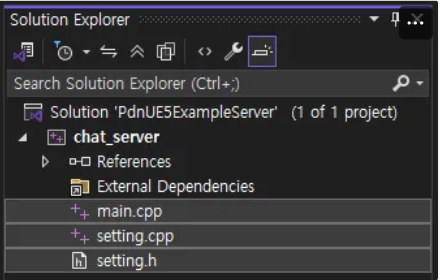
    
3. chat_server 프로젝트의 속성을 수정합니다.
   1. "C/C++ - 언어 - C++ 언어 표준"
      1. 드롭다운에서 "ISO C++20 표준 (/std:C++20)" 선택
   2. "C/C++ - 일반 - 추가 포함 디렉터리"
      1. 드롭다운에서 <편집…> 선택
      2. 팝업 창에 아래 경로 추가
            
   ```
   C:\Program Files (x86)\Nettention\ProudNet\include
   ```

   3. "링커 - 일반 - 추가 라이브러리 디렉터리"
      1. 드롭다운에서 <편집…> 선택
      2. 팝업 창에 아래 경로 추가
            
   ```
   C:\Program Files (x86)\Nettention\ProudNet\lib\$(Platform)\v140\$(Configuration)
   ```

   4. "링커 - 입력 - 추가 종속성"
      1. 드롭다운에서 <편집…> 선택
      2. 팝업 창에 아래 파일명 추가
            
   ```
   ProudNetServer.lib
   ProudNetClient.lib
   ```

   5. "빌드 이벤트 - 빌드 후 이벤트 - 명령줄"
      1. 드롭다운에서 <편집…> 선택
      2. 팝업 창에 아래 명령 추가
            
         ```
         xcopy /Y "C:\Program Files (x86)\Nettention\ProudNet\lib\$(Platform)\v140\$(Configuration)\libcrypto-3-x64.dll" "$(OutDir)"
         xcopy /Y "C:\Program Files (x86)\Nettention\ProudNet\lib\$(Platform)\v140\$(Configuration)\libssl-3-x64.dll" "$(OutDir)"
         ```
            
4. 각 소스 파일에 코드를 입력합니다.
   - setting.h (diff)
        
     ```diff
     + #pragma once
     + 
     + namespace ProudSetting
     + {
     +     namespace CHAT
     +     {
     +         extern const ::Proud::Guid version;
     +         extern const int server_port;
     +     }
     + }
     + 
     ```
        
   - setting.cpp (diff)
        
     ```diff
     + #include <ProudNetClient.h>
     + #include "setting.h"
     + 
     + namespace ProudSetting
     + {
     +     namespace CHAT
     +     {
     +         const ::Proud::PNGUID guid = { 0x3ae33249, 0xecc6, 0x4980, { 0xbc, 0x5d, 0x7b, 0xa, 0x99, 0x9c, 0x7, 0x39 } };
     +         const ::Proud::Guid version = ::Proud::Guid(guid);
     +         const int server_port = 33337;
     +     }
     + }
     + 
     ```
        
   - main.cpp (diff)
        
     ```diff
     + #include <iostream>
     + #include <format>
     + #include <memory>
     + 
     + #include <ProudNetServer.h>
     + #include "setting.h"
     + 
     + std::shared_ptr<Proud::CNetServer> net_server;
     + 
     + int main()
     + {
     + 	net_server = std::shared_ptr<Proud::CNetServer>(Proud::CNetServer::Create());
     + 
     + 	net_server->OnClientJoin = [](Proud::CNetClientInfo* clientInfo)
     + 		{
     + 			std::cout << "Client[" << (int)clientInfo->m_HostID << "] connected.\n";
     + 		};
     + 	net_server->OnClientLeave = [](Proud::CNetClientInfo* clientInfo, Proud::ErrorInfo* error, const Proud::ByteArray byte_arr)
     + 		{
     + 			std::cout << "Client[" << (int)clientInfo->m_HostID << "] disconnected.\n";
     + 		};
     + 
     + 	Proud::CStartServerParameter start_param;
     + 	start_param.m_protocolVersion = ProudSetting::CHAT::version;
     + 	start_param.m_tcpPorts.Add(ProudSetting::CHAT::server_port);
     + 
     + 	try
     + 	{
     + 		net_server->Start(start_param);
     + 	}
     + 	catch (Proud::Exception& error)
     + 	{
     + 		std::cout << "Server start failed: " << error.what() << endl;
     + 		return 0;
     + 	}
     + 
     + 	std::cout << ("Server started. Enterable commands:\n");
     + 	std::cout << ("-q : Quit.\n");
     + 	std::string input;
     + 	while (true)
     + 	{
     + 		std::cin >> input;
     + 		if (input[0] == '-')
     + 		{
     + 			if (input == "-q")
     + 				break;
     + 		}
     + 	}
     + 
     + 	std::cout << "Stopping server...\n";
     + 	net_server->Stop();
     + 	net_server = nullptr;
     + 	std::cout << "Server stopped.\n";
     + 	return 0;
     + }
     + 
     ```
        
   - 전체 코드
     - setting.h
            
       ```cpp
       #pragma once

       namespace ProudSetting
       {
           namespace CHAT
           {
               extern const ::Proud::Guid version;
               extern const int server_port;
           }
       }
       ```
            
     - setting.cpp
            
       ```cpp
       #include <ProudNetClient.h>
       #include "setting.h"

       namespace ProudSetting
       {
           namespace CHAT
           {
               const ::Proud::PNGUID guid = { 0x3ae33249, 0xecc6, 0x4980, { 0xbc, 0x5d, 0x7b, 0xa, 0x99, 0x9c, 0x7, 0x39 } };
               const ::Proud::Guid version = ::Proud::Guid(guid);
               const int server_port = 33337;
           }
       }
       ```
            
     - main.cpp
            
       ```cpp
       #include <iostream>
       #include <format>
       #include <memory>

       #include <ProudNetServer.h>
       #include "setting.h"

       std::shared_ptr<Proud::CNetServer> net_server;

       int main()
       {
       	net_server = std::shared_ptr<Proud::CNetServer>(Proud::CNetServer::Create());

       	net_server->OnClientJoin = [](Proud::CNetClientInfo* clientInfo)
       		{
       			std::cout << "Client[" << (int)clientInfo->m_HostID << "] connected.\n";
       		};
       	net_server->OnClientLeave = [](Proud::CNetClientInfo* clientInfo, Proud::ErrorInfo* error, const Proud::ByteArray byte_arr)
       		{
       			std::cout << "Client[" << (int)clientInfo->m_HostID << "] disconnected.\n";
       		};

       	Proud::CStartServerParameter start_param;
       	start_param.m_protocolVersion = ProudSetting::CHAT::version;
       	start_param.m_tcpPorts.Add(ProudSetting::CHAT::server_port);

       	try
       	{
       		net_server->Start(start_param);
       	}
       	catch (Proud::Exception& error)
       	{
       		std::cout << "Server start failed: " << error.what() << endl;
       		return 0;
       	}

       	std::cout << ("Server started. Enterable commands:\n");
       	std::cout << ("-q : Quit.\n");
       	std::string input;
       	while (true)
       	{
       		std::cin >> input;
       		if (input[0] == '-')
       		{
       			if (input == "-q")
       				break;
       		}
       	}

       	std::cout << "Stopping server...\n";
       	net_server->Stop();
       	net_server = nullptr;
       	std::cout << "Server stopped.\n";
       	return 0;
       }
       ```
            
5. 프로젝트를 빌드 및 실행(F5) 하면 아래와 같은 화면을 볼 수 있습니다.
    
   

### 1.3. Unreal Engine 프로젝트 구성

1. [Infima Games의 Free FPS Template](https://www.fab.com/listings/6a0af880-2b74-480c-a82c-8e597918dffe)를 라이브러리에 추가합니다.
2. 아래 절차에 따라 템플릿 프로젝트를 생성합니다.
   1. 에픽게임즈 런처 실행
   2. 언리얼 엔진 탭으로 이동
   3. 라이브러리 탭으로 이동
   4. 팹 라이브러리 목록에서 "Free FPS Template & Tutorial"의 프로젝트 생성 클릭
   5. 이름 및 폴더를 변경하고 생성 클릭
      - 가이드에서는 아래와 같은 이름과 경로를 사용합니다.
            
        
            
3. 아래 절차에 따라 C++ 클래스를 생성합니다.
   1. 상단 툴바 - 틀 - 새로운 C++ 클래스
        
      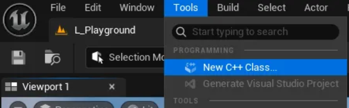
        
   2. 모든 클래스 지정 후 GameInstanceSubsystem 선택
        
      
        
   3. 클래스 타입 - 퍼블릭 선택 및 클래스 이름 입력 후 클래스 생성
      1. 가이드에서는 GissChatNet을 사용합니다.
            
         
            
4. 아래 절차에 따라 언리얼 프로젝트의 VS 솔루션을 생성합니다.
   1. 언리얼 엔진 에디터를 닫습니다.
   2. 언리얼 프로젝트 폴더로 이동합니다.
   3. PdnUE5ExampleClient.uproject 우클릭 후 Generate Visual Studio project files 선택
5. 시작 프로젝트를 변경합니다 (권장)
   - 가이드 이미지
        
     
        
6. 아래 절차에 따라 UE5 ProudNet 플러그인을 적용합니다.
   1. 언리얼 프로젝트 폴더를 엽니다.
        
      숏컷 : 에픽게임즈 런처 → 내 프로젝트 목록 → 프로젝트 우클릭 → 폴더 보기
        
   2. 아래 파일을 압축 해제한 뒤 Plugins 폴더에 넣습니다.
        
      Plugins 폴더가 없다면 새로 만듭니다.
        
      [ProudNet UE5 Lib Linker Plugin.zip](attachment:3e5108f9-f75b-439a-a9d3-fd1c3312e52c:ProudNet_UE5_Linker_Plugin.zip)
        
      
        
   3. Visual Project 솔루션을 다시 생성 합니다.
      1. VisualStudio IDE를 닫습니다.
      2. PdnUE5ExampleClient.uproject 우클릭 후 Generate Visual Studio project files 선택
   4. PdnUE5ExampleClient.Build.cs의 코드를 수정합니다.
      - 가이드 이미지
            
        
            
      - 수정 사항
            
   ```diff
   // Fill out your copyright notice in the Description page of Project Settings.
   
   using UnrealBuildTool;
   
   public class PdnUE5ExampleClient : ModuleRules
   {
   	public PdnUE5ExampleClient(ReadOnlyTargetRules Target) : base(Target)
   	{
   		PCHUsage = PCHUsageMode.UseExplicitOrSharedPCHs;
   	
        - 		PublicDependencyModuleNames.AddRange(new string[] { "Core", "CoreUObject", "Engine", "InputCore" });
        + 		PublicDependencyModuleNames.AddRange(new string[] { "Core", "CoreUObject", "Engine", "InputCore", "ProudNet" });
   
   		PrivateDependencyModuleNames.AddRange(new string[] {  });
   
   		// Uncomment if you are using Slate UI
   		// PrivateDependencyModuleNames.AddRange(new string[] { "Slate", "SlateCore" });
   		
   		// Uncomment if you are using online features
   		// PrivateDependencyModuleNames.Add("OnlineSubsystem");
   
   		// To include OnlineSubsystemSteam, add it to the plugins section in your uproject file with the Enabled attribute set to true
   	}
   }
        
   ```
   
      - 전체 코드
            
   ```cpp
   // Fill out your copyright notice in the Description page of Project Settings.
   
   using UnrealBuildTool;
   
   public class PdnUE5ExampleClient : ModuleRules
   {
   	public PdnUE5ExampleClient(ReadOnlyTargetRules Target) : base(Target)
   	{
   		PCHUsage = PCHUsageMode.UseExplicitOrSharedPCHs;
   	
   		PublicDependencyModuleNames.AddRange(new string[] { "Core", "CoreUObject", "Engine", "InputCore", "ProudNet" });
   
   		PrivateDependencyModuleNames.AddRange(new string[] {  });
   
   		// Uncomment if you are using Slate UI
   		// PrivateDependencyModuleNames.AddRange(new string[] { "Slate", "SlateCore" });
   		
   		// Uncomment if you are using online features
   		// PrivateDependencyModuleNames.Add("OnlineSubsystem");
   
   		// To include OnlineSubsystemSteam, add it to the plugins section in your uproject file with the Enabled attribute set to true
   	}
   }
   ```

7. GissChatNet.h와 .cpp의 코드를 수정합니다.
   - 가이드 이미지
        
     
        
   - GissChatNet.h (diff)
        
     ```diff
       // Fill out your copyright notice in the Description page of Project Settings.
       
       #pragma once
       
       #include "CoreMinimal.h"
       #include "Subsystems/GameInstanceSubsystem.h"
       #include "GissChatNet.generated.h"
       
       /**
        *
        */
       UCLASS()
       class PDNUE5EXAMPLECLIENT_API UGissChatNet : public UGameInstanceSubsystem
       {
       	GENERATED_BODY()
     
     +   private:
     + 	  virtual void Initialize(FSubsystemCollectionBase& Collection) override;
     + 	  virtual void Deinitialize() override;
       };
       
     ```
        
   - GissChatNet.cpp (diff)
        
     ```diff
       // Fill out your copyright notice in the Description page of Project Settings.
       
       
       #include "GissChatNet.h"
       
     + #include <format>
     + #include <functional>
     + 
     + #include <ProudNetClient.h>
     + #include "C:/proudnet_ue5_example/PdnUE5ExampleServer/chat_server/setting.h"
     + #include "C:/proudnet_ue5_example/PdnUE5ExampleServer/chat_server/setting.cpp"
     + 
     + static void LogPrint(const std::string& str)
     + {
     + 	UE_LOG(LogTemp, Log, TEXT("%s"), UTF8_TO_TCHAR(str.c_str()));
     + }
     + 
     + static Proud::CriticalSection global_critical_section;
     + static std::shared_ptr<Proud::CNetClient> net_client;
     + static FDelegateHandle update_handle;
     + 
     + void UGissChatNet::Initialize(FSubsystemCollectionBase& Collection)
     + {
     + 	net_client = std::shared_ptr<Proud::CNetClient>(Proud::CNetClient::Create());
     + 
     + 	bool connected = false;
     + 
     + 	net_client->OnJoinServerComplete = [&](Proud::ErrorInfo* info, const Proud::ByteArray& replyFromServer)
     + 		{
     + 			Proud::CriticalSectionLock lock(global_critical_section, true);
     + 
     + 			if (info->m_errorType == Proud::ErrorType::Ok)
     + 			{
     + 				auto log = std::format("Succeed to connect server. Allocated hostID={}\n", (int)net_client->GetLocalHostID());
     + 				LogPrint(log);
     + 
     + 				connected = true;
     + 			}
     + 			else
     + 			{
     + 				auto log = "Failed to connect to server.\n";
     + 				LogPrint(log);
     + 			}
     + 		};
     + 
     + 	net_client->OnLeaveServer = [&](Proud::ErrorInfo* errorInfo)
     + 		{
     + 			Proud::CriticalSectionLock lock(global_critical_section, true);
     + 
     + 			auto log = std::format("OnLeaveServer. {}  \n", StringT2A(errorInfo->m_comment).GetString());
     + 			LogPrint(log);
     + 
     + 			connected = false;
     + 			if (update_handle.IsValid())
     + 			{
     + 				FCoreDelegates::OnEndFrame.Remove(update_handle);
     + 				update_handle.Reset();
     + 			}
     + 		};
     + 
     + 
     + 	Proud::CNetConnectionParam connection_param;
     + 	connection_param.m_protocolVersion = ProudSetting::CHAT::version;
     + 	connection_param.m_serverIP = _PNT("localhost");
     + 	connection_param.m_serverPort = ProudSetting::CHAT::server_port;
     + 	connection_param.m_closeNoPingPongTcpConnections = false;
     + 
     + 	net_client->Connect(connection_param);
     + 
     + 	update_handle = FCoreDelegates::OnEndFrame.AddStatic([]()
     + 		{
     + 			if (net_client)
     + 				net_client->FrameMove();
     + 		}
     + 	);
     + }
     + 
     + void UGissChatNet::Deinitialize()
     + {
     + 	net_client->Disconnect();
     + 	net_client = nullptr;
     + }
     + 
     ```
        
   - 전체 코드
     - GissChatNet.h
            
       ```cpp
       // Fill out your copyright notice in the Description page of Project Settings.

       #pragma once

       #include "CoreMinimal.h"
       #include "Subsystems/GameInstanceSubsystem.h"
       #include "GissChatNet.generated.h"

       /**
        *
        */
       UCLASS()
       class PDNUE5EXAMPLECLIENT_API UGissChatNet : public UGameInstanceSubsystem
       {
       	GENERATED_BODY()

       private:
       	virtual void Initialize(FSubsystemCollectionBase& Collection) override;
       	virtual void Deinitialize() override;
       };
       ```
            
     - GissChatNet.cpp
            
       ```cpp
       // Fill out your copyright notice in the Description page of Project Settings.

       #include "GissChatNet.h"

       #include <format>
       #include <functional>

       #include <ProudNetClient.h>
       #include "C:/proudnet_ue5_example/PdnUE5ExampleServer/chat_server/setting.h"
       #include "C:/proudnet_ue5_example/PdnUE5ExampleServer/chat_server/setting.cpp"

       static void LogPrint(const std::string& str)
       {
       	UE_LOG(LogTemp, Log, TEXT("%s"), UTF8_TO_TCHAR(str.c_str()));
       }

       static Proud::CriticalSection global_critical_section;
       static std::shared_ptr<Proud::CNetClient> net_client;
       static FDelegateHandle update_handle;

       void UGissChatNet::Initialize(FSubsystemCollectionBase& Collection)
       {
       	net_client = std::shared_ptr<Proud::CNetClient>(Proud::CNetClient::Create());

       	bool connected = false;

       	net_client->OnJoinServerComplete = [&](Proud::ErrorInfo* info, const Proud::ByteArray& replyFromServer)
       		{
       			Proud::CriticalSectionLock lock(global_critical_section, true);

       			if (info->m_errorType == Proud::ErrorType::Ok)
       			{
       				auto log = std::format("Succeed to connect server. Allocated hostID={}\n", (int)net_client->GetLocalHostID());
       				LogPrint(log);

       				connected = true;
       			}
       			else
       			{
       				auto log = "Failed to connect to server.\n";
       				LogPrint(log);
       			}
       		};

       	net_client->OnLeaveServer = [&](Proud::ErrorInfo* errorInfo)
       		{
       			Proud::CriticalSectionLock lock(global_critical_section, true);

       			auto log = std::format("OnLeaveServer. {}  \n", StringT2A(errorInfo->m_comment).GetString());
       			LogPrint(log);

       			connected = false;
       			if (update_handle.IsValid())
       			{
       				FCoreDelegates::OnEndFrame.Remove(update_handle);
       				update_handle.Reset();
       			}
       		};

       	Proud::CNetConnectionParam connection_param;
       	connection_param.m_protocolVersion = ProudSetting::CHAT::version;
       	connection_param.m_serverIP = _PNT("localhost");
       	connection_param.m_serverPort = ProudSetting::CHAT::server_port;
       	connection_param.m_closeNoPingPongTcpConnections = false;

       	net_client->Connect(connection_param);

       	update_handle = FCoreDelegates::OnEndFrame.AddStatic([]()
       		{
       			if (net_client)
       				net_client->FrameMove();
       		}
       	);
       }

       void UGissChatNet::Deinitialize()
       {
       	net_client->Disconnect();
       	net_client = nullptr;
       }
       ```
            
8. 테스트
   1. PdnUE5ExampleServer의 chat_server를 빌드 및 실행합니다.
        
      
        
   2. PdnUE5ExampleClient를 빌드하고 언리얼 엔진 에디터에서 레벨을 실행합니다.
        
      
        
   3. 아래와 같이 클라이언트와 서버가 연결되면 성공입니다.
      
      

---

## 2. 로컬 채팅창 만들기

이 섹션에서는 Unreal Engine 5에서 로컬 채팅창을 만들고 기본적인 채팅 기능을 구현합니다.

### 2.1. 채팅창 위젯 만들기

1. 아래 절차에 따라 BP_ChatWidget 위젯 블루프린트를 생성합니다
   1. 콘텐츠 브라우저의 빈 곳을 우클릭 하여 콘텍스트 메뉴를 엽니다.
   2. "고급 애셋 생성 - 유저 인터페이스 - 위젯 블루프린트"를 선택합니다.
        
      
        
   3. "사용자 위젯"을 선택합니다
   4. 이름을 BP_ChatWidget 으로 변경합니다
        
      
        
2. 아래 절차에 따라 BP_ChatWidget 위젯의 모습을 구성합니다.
   1. BP_ChatWidget 를 더블클릭하여 블루프린트 에디터를 엽니다.
   2. 아래의 구조에 맞게 위젯을 구성합니다.
      - 위젯 요소 구조
            
        ```
        >> 캔버스 패널
        	>> 캔버스 패널
        		- 앵커: 좌하단
        		- 위치: [x: 100, y: -200]
        		- 크기: [x: 640, y: 360]
        		- 정렬: [x: 0, y: 1]
        		>> 스크롤 박스
        			- 앵커: 상단
        			- 위치: [x: 0, y: 0]
        			- 크기: [x: 640, y: 300]
        			- 정렬: [x: 0.5, y: 0]
        		>> 캔버스 패널
        			- 앵커: 하단
        			- 위치: [x: 0, y: 0]
        			- 크기: [x: 640, y: 48]
        			- 정렬: [x: 0.5, y: 1]
        			>> 텍스트 박스
        				- 앵커: 왼쪽
        				- 위치: [x: 0, y: 0]
        				- 크기: [x: 520, y: 48]
        				- 정렬: [x: 0, y: 0.5]
        			>> 버튼
        				- 앵커: 오른쪽
        				- 위치: [x: 0, y: 0]
        				- 크기: [x: 100, y: 48]
        				- 정렬: [x: 1, y: 0.5]
        				>> 텍스트
        					- 텍스트: "전송"
        ```
            
      구성 완료 시 모습은 아래와 같습니다.
        
      
        
3. 아래 절차에 따라 BP_ChatWidget을 뷰포트에 추가합니다.
   1. 레벨 블루프린트 에디터를 엽니다.
        
      
        
   2. Create Widget 노드를 추가하고, 클래스를 BP_ChatWidget으로 변경합니다.
        
      
        
      
        
   3. Add to Viewport 노드를 추가하고 연결합니다.
        
      
        
      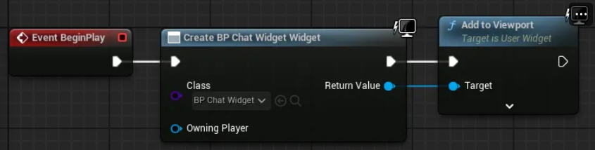
        
4. 레벨을 실행하고 채팅창이 추가된 것을 확인합니다.
    
   

### 2.2. 채팅 기능 구현하기

1. 새로운 위젯 블루프린트 BP_ChatBlock을 만들고 모습을 구성합니다.
   1. 아래의 구조에 맞게 위젯을 구성합니다.
      - 위젯 요소 구조
            
        ```
        >> 캔버스 패널
        	>> 보더
        		- 앵커: 좌상단
        		- 위치: [x: 0, y: 0]
        		- 크기: [x: 640, y: 40]
        		- 정렬: [x: 0, y: 0]
        		- 브러시 컬러: [R: 1, G: 1, B: 1, A: 0.5]
        		>> 텍스트
        			> 이름: ChatText
        			> 변수 여부 체크
        			- 가로정렬: 왼쪽
        			- 세로정렬: 중앙
        			- 폰트-크기: 20
        ```
            
      구성 완료 시 모습은 아래와 같습니다.
        
      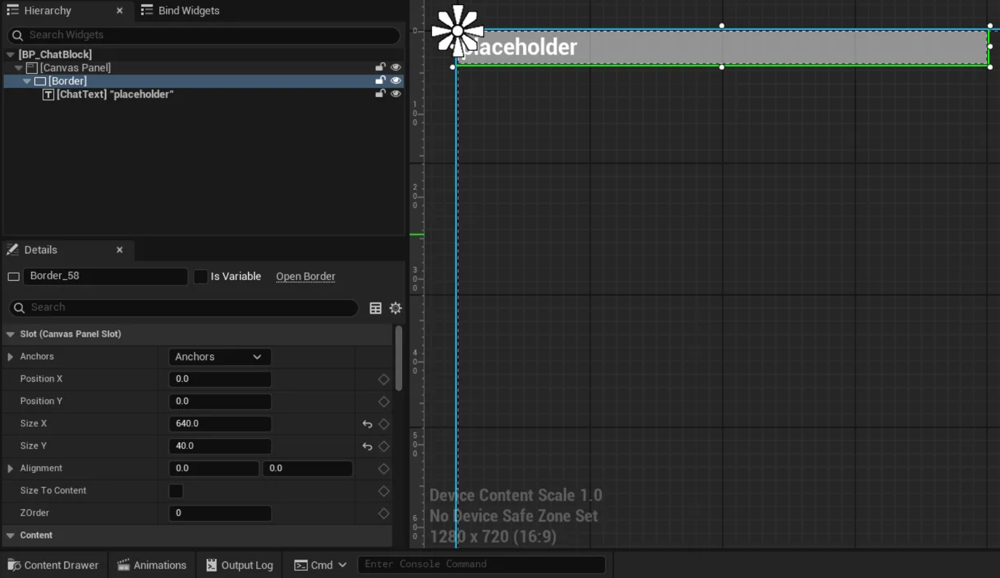
        
2. 아래 절차에 따라 BP_ChatBlock 위젯의 블루프린트를 구성합니다.
   1. 블루프린트 그래프 모드로 전환합니다.
        
      
        
   2. SetChatText 함수를 구성합니다.
      1. 블루프린트 창에서 함수를 생성합니다.
            
         
            
      2. 디테일 창에서 함수 인자를 설정합니다.
            
         
            
      3. 블루프린트 창의 변수 목록에서 ChatText를 드래그 하여 Get ChatText를 선택합니다.
      4. SetText (Text) 노드를 생성하고 연결합니다.
      다른 항목을 착각하여 선택하지 않도록 주의해야 합니다.
            
         
            
         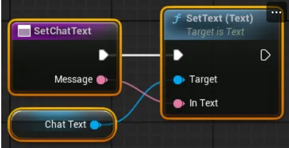
            
3. 아래 절차에 따라 BP_ChatWidget 위젯을 구성합니다.
   1. BP_ChatWidget 블루프린트 에디터를 열고, 디자이너 모드로 전환합니다.
   2. 아래를 참고하여 위젯을 수정합니다.
      - 위젯 요소 구조
            
        ```
        -> 캔버스 패널
        	-> 캔버스 패널
        		-> 스크롤 박스
        			> 이름: ChatBlockArea
        			> 변수 여부 체크
        		-> 캔버스 패널
        			-> 버튼
        				> 이름: SendButton
        				> 변수 여부 체크
        			-> 텍스트 박스
        				> 이름: ChatTextBox
        				> 변수 여부 체크
        ```
            
      수정 후 모습은 아래와 같습니다.
        
      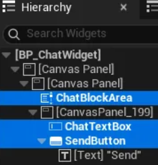
        
   3. 블루프린트 에디터를 그래프 모드로 전환합니다.
   4. PrintChat 함수를 구성합니다.
      1. 함수를 추가합니다.
            
         
            
      2. Create Widget 노드를 추가하고 클래스에 BP_ChatBlock을 지정합니다.
      3. BP_ChatBlock의 SetChatText 노드를 추가하고 연결합니다.
      4. 변수의 ChatBlockArea를 드래그하여 추가합니다.
      5. Add Child 노드를 추가하고 연결합니다.
            
         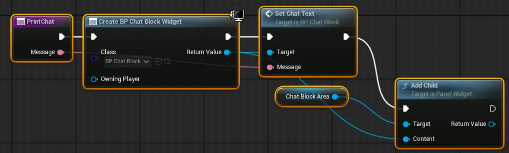
            
   5. 채팅 메세지 전송 이벤트를 구현합니다.
      1. 변수에서 SendButton를 선택하고 클릭 시 이벤트를 추가합니다.
            
         
            
      2. 변수 ChatTextBox와 함수 PrintChat를 드래그 하여 추가합니다.
      3. Get Text (Text Box) 노드를 추가하고 모두 연결합니다.
            
         
            
   6. 아래와 같이 블루프린트 그래프를 수정하여 추가 기능 구현이 가능합니다. (선택 사항)
        
      
        
      
        
      1. 입력된 메세지가 없으면 전송 무시
      2. 메세지 전송 후 입력한 메세지 자동 삭제
      3. 새로운 채팅이 있으면 채팅창이 맨 아래로 자동 스크롤
4. 레벨을 실행하고 채팅 기능이 추가된 것을 확인합니다.
    
   

---

## 3. 온라인 채팅창 만들기

이 섹션에서는 ProudNet을 사용하여 네트워크 채팅 기능을 구현합니다.

### 3.1. Visual Studio 프로젝트 작업

1. PdnUE5ExampleServer에서 새로운 빈 프로젝트 chat_pidl을 추가합니다.

2. 두 개의 파일 C2S.PIDL, S2C.PIDL을 추가하고, 속성을 수정합니다.
   1. "일반 - 항목 형식"
      드롭다운에서 "사용자 지정 빌드 도구" 선택
   2. "사용자 지정 빌드 도구 - 일반 - 명령줄"
      텍스트 입력
      ```
      C:\"Program Files (x86)"\Nettention\ProudNet\util\PIDL.exe "%(FullPath)" -cpp
      ```
   3. "사용자 지정 빌드 도구 - 일반 - 설명"
      텍스트 입력
      ```
      %(Filename).PIDL Compiling...
      ```
   4. "사용자 지정 빌드 도구 - 일반 - 출력"
      드롭다운에서 <편집…> 선택
      팝업 창에 아래 경로 추가
      ```
      %(RootDir)%(Directory)\%(Filename)_common.cpp
      %(RootDir)%(Directory)\%(Filename)_common.h
      %(RootDir)%(Directory)\%(Filename)_proxy.cpp
      %(RootDir)%(Directory)\%(Filename)_proxy.h
      %(RootDir)%(Directory)\%(Filename)_stub.cpp
      %(RootDir)%(Directory)\%(Filename)_stub.h
      ```

3. 각 파일에 코드를 입력합니다.
   - 전체 코드
     - C2S.PIDL
       ```pidl
       [access=public]
       global CHAT_C2S 3000
       {
           Chat([in] Proud::String message);
       }
       ```
     - S2C.PIDL
       ```pidl
       [access=public]
       global CHAT_S2C 4000
       {
           SystemChat([in] Proud::String message);
           BroadcastChat([in] int sender_id, [in] Proud::String message);
       }
       ```

4. chat_pidl 프로젝트를 빌드합니다.
   chat_pidl 프로젝트 폴더에서 빌드된 소스 코드 파일들을 확인할 수 있습니다.

   

5. chat_server 프로젝트의 main.cpp 소스 코드를 수정합니다.
   - 수정 내역
     ```diff
       #include <iostream>
       #include <format>
       #include <memory>
       
       #include <ProudNetServer.h>
       #include "setting.h"
       
     + #include "../chat_pidl/S2C_common.h"
     + #include "../chat_pidl/S2C_common.cpp"
     + #include "../chat_pidl/S2C_proxy.h"
     + #include "../chat_pidl/S2C_proxy.cpp"
     + 
     + #include "../chat_pidl/C2S_common.h"
     + #include "../chat_pidl/C2S_common.cpp"
     + #include "../chat_pidl/C2S_stub.h"
     + #include "../chat_pidl/C2S_stub.cpp"
     + 
     + 
     + Proud::HostID group_host_id = Proud::HostID_None;
     + CHAT_S2C::Proxy s2c_proxy;
     + 
     + struct CHAT_C2S_Stub : public CHAT_C2S::Stub
     + {
     + public:
     + 	DECRMI_CHAT_C2S_Chat;
     + };
     + 
     + DEFRMI_CHAT_C2S_Chat(CHAT_C2S_Stub)
     + {
     + 	Proud::RmiContext rmi_context;
     + 	rmi_context.m_enableLoopback = false;
     + 	s2c_proxy.BroadcastChat(group_host_id, rmi_context, (int)remote, message);
     + 	std::cout << std::format("Player[{}] say {}\n", (int)remote, StringT2A(message).GetString());
     + 	return true;
     + }
     + 
     + CHAT_C2S_Stub c2s_stub;
       std::shared_ptr<Proud::CNetServer> net_server;
       
       int main()
       {
       	net_server = std::shared_ptr<Proud::CNetServer>(Proud::CNetServer::Create());
       
       	net_server->OnClientJoin = [](Proud::CNetClientInfo* clientInfo)
       		{
       			std::cout << "Client[" << (int)clientInfo->m_HostID << "] connected.\n";
     + 
     + 			Proud::HostID list[100];
     + 			int listCount = net_server->GetClientHostIDs(list, 100);
     + 			group_host_id = net_server->CreateP2PGroup(list, listCount, Proud::ByteArray());
     + 
     + 			auto message = std::format("Player[{}] has joined.", (int)clientInfo->m_HostID);
     + 			Proud::RmiContext rmi_context;
     + 			s2c_proxy.SystemChat(group_host_id, rmi_context, message);
       		};
       	net_server->OnClientLeave = [](Proud::CNetClientInfo* clientInfo, Proud::ErrorInfo* error, const Proud::ByteArray byte_arr)
       		{
       			std::cout << "Client[" << (int)clientInfo->m_HostID << "] disconnected.\n";
     + 
     + 			auto message = std::format("Player[{}] has left the game.", (int)clientInfo->m_HostID);
     + 			Proud::RmiContext rmi_context;
     + 			s2c_proxy.SystemChat(group_host_id, rmi_context, message);
       		};
       
     + 	net_server->AttachProxy(&s2c_proxy);
     + 	net_server->AttachStub(&c2s_stub);
     + 
       	Proud::CStartServerParameter start_param;
       	start_param.m_protocolVersion = ProudSetting::CHAT::version;
       	start_param.m_tcpPorts.Add(ProudSetting::CHAT::server_port);
       
       	try
       	{
       		net_server->Start(start_param);
       	}
       	catch (Proud::Exception& error)
       	{
       		std::cout << "Server start failed: " << error.what() << endl;
       		return 0;
       	}
       
       	std::cout << ("Server started. Enterable commands:\n");
       	std::cout << ("-q : Quit.\n");
       	std::string input;
       	while (true)
       	{
       		std::cin >> input;
       		if (input[0] == '-')
       		{
       			if (input == "-q")
       				break;
       		}
     + 		else
     + 		{
     + 			Proud::RmiContext rmi_context;
     + 			s2c_proxy.SystemChat(group_host_id, rmi_context, input);
     + 		}
       	}
       
       	std::cout << "Stopping server...\n";
       	net_server->Stop();
       	net_server = nullptr;
       	std::cout << "Server stopped.\n";
       	return 0;
       }
     ```

   - 전체 코드
     - main.cpp
       ```cpp
       #include <iostream>
       #include <format>
       #include <memory>

       #include <ProudNetServer.h>
       #include "setting.h"

       #include "../chat_pidl/S2C_common.h"
       #include "../chat_pidl/S2C_common.cpp"
       #include "../chat_pidl/S2C_proxy.h"
       #include "../chat_pidl/S2C_proxy.cpp"

       #include "../chat_pidl/C2S_common.h"
       #include "../chat_pidl/C2S_common.cpp"
       #include "../chat_pidl/C2S_stub.h"
       #include "../chat_pidl/C2S_stub.cpp"


       Proud::HostID group_host_id = Proud::HostID_None;
       CHAT_S2C::Proxy s2c_proxy;

       struct CHAT_C2S_Stub : public CHAT_C2S::Stub
       {
       public:
       	DECRMI_CHAT_C2S_Chat;
       };

       DEFRMI_CHAT_C2S_Chat(CHAT_C2S_Stub)
       {
       	Proud::RmiContext rmi_context;
       	rmi_context.m_enableLoopback = false;
       	s2c_proxy.BroadcastChat(group_host_id, rmi_context, (int)remote, message);
       	std::cout << std::format("Player[{}] say {}\n", (int)remote, StringT2A(message).GetString());
       	return true;
       }

       CHAT_C2S_Stub c2s_stub;
       std::shared_ptr<Proud::CNetServer> net_server;

       int main()
       {
       	net_server = std::shared_ptr<Proud::CNetServer>(Proud::CNetServer::Create());

       	net_server->OnClientJoin = [](Proud::CNetClientInfo* clientInfo)
       		{
       			std::cout << "Client[" << (int)clientInfo->m_HostID << "] connected.\n";

       			Proud::HostID list[100];
       			int listCount = net_server->GetClientHostIDs(list, 100);
       			group_host_id = net_server->CreateP2PGroup(list, listCount, Proud::ByteArray());

       			auto message = std::format("Player[{}] has joined.", (int)clientInfo->m_HostID);
       			Proud::RmiContext rmi_context;
       			s2c_proxy.SystemChat(group_host_id, rmi_context, message);
       		};
       	net_server->OnClientLeave = [](Proud::CNetClientInfo* clientInfo, Proud::ErrorInfo* error, const Proud::ByteArray byte_arr)
       		{
       			std::cout << "Client[" << (int)clientInfo->m_HostID << "] disconnected.\n";

       			auto message = std::format("Player[{}] has left the game.", (int)clientInfo->m_HostID);
       			Proud::RmiContext rmi_context;
       			s2c_proxy.SystemChat(group_host_id, rmi_context, message);
       		};

       	net_server->AttachProxy(&s2c_proxy);
       	net_server->AttachStub(&c2s_stub);

       	Proud::CStartServerParameter start_param;
       	start_param.m_protocolVersion = ProudSetting::CHAT::version;
       	start_param.m_tcpPorts.Add(ProudSetting::CHAT::server_port);

       	try
       	{
       		net_server->Start(start_param);
       	}
       	catch (Proud::Exception& error)
       	{
       		std::cout << "Server start failed: " << error.what() << endl;
       		return 0;
       	}

       	std::cout << ("Server started. Enterable commands:\n");
       	std::cout << ("-q : Quit.\n");
       	std::string input;
       	while (true)
       	{
       		std::cin >> input;
       		if (input[0] == '-')
       		{
       			if (input == "-q")
       				break;
       		}
       		else
       		{
       			Proud::RmiContext rmi_context;
       			s2c_proxy.SystemChat(group_host_id, rmi_context, input);
       		}
       	}

       	std::cout << "Stopping server...\n";
       	net_server->Stop();
       	net_server = nullptr;
       	std::cout << "Server stopped.\n";
       	return 0;
               }
        ```

### 3.2. 언리얼 프로젝트 작업

1. 언리얼 엔진 에디터에서 UserWidget을 상속받는 C++ 클래스 BaseChatWidget을 생성합니다.

2. 생성된 BaseChatWidget 클래스의 소스 코드를 수정합니다.
   - 수정 내역
     - BaseChatWidget.h
            
       ```diff
         // Fill out your copyright notice in the Description page of Project Settings.
         
         #pragma once
         
         #include "CoreMinimal.h"
         #include "Blueprint/UserWidget.h"
         #include "BaseChatWidget.generated.h"
         
         /**
          * 
          */
         UCLASS()
         class PDNUE5EXAMPLECLIENT_API UBaseChatWidget : public UUserWidget
         {
         	GENERATED_BODY()
         
       + public:
       + 	UFUNCTION(BlueprintImplementableEvent)
       + 	void PrintChat(const FText& message);
         };
       ```
            
   - 전체 코드
     - BaseChatWidget.h
            
       ```cpp
       // Fill out your copyright notice in the Description page of Project Settings.

       #pragma once

       #include "CoreMinimal.h"
       #include "Blueprint/UserWidget.h"
       #include "BaseChatWidget.generated.h"

       /**
        * 
        */
       UCLASS()
       class PDNUE5EXAMPLECLIENT_API UBaseChatWidget : public UUserWidget
       {
       	GENERATED_BODY()
       	
       public:
       	UFUNCTION(BlueprintImplementableEvent)
       	void PrintChat(const FText& message);
       };
       ```
            
3. GissChatNet 클래스의 소스 코드를 수정합니다.
   - 수정 내역
     - GissChatNet.h
            
       ```diff
         // Fill out your copyright notice in the Description page of Project Settings.
         
         #pragma once
         
         #include "CoreMinimal.h"
         #include "Subsystems/GameInstanceSubsystem.h"
         #include "GissChatNet.generated.h"
         
         /**
          *
          */
         UCLASS()
         class PDNUE5EXAMPLECLIENT_API UGissChatNet : public UGameInstanceSubsystem
         {
         	GENERATED_BODY()
         
       + public:
       + 	UFUNCTION(BlueprintCallable)
       + 	void SendChat(const FText& message);
       + 
         private:
         	virtual void Initialize(FSubsystemCollectionBase& Collection) override;
         	virtual void Deinitialize() override;
         };
       ```
            
     - GissChatNet.cpp
            
       ```diff
         // Fill out your copyright notice in the Description page of Project Settings.
         
         
         #include "GissChatNet.h"
         
         #include <format>
         #include <functional>
         
         #include <ProudNetClient.h>
         #include "C:/proudnet_ue5_example/PdnUE5ExampleServer/chat_server/setting.h"
         #include "C:/proudnet_ue5_example/PdnUE5ExampleServer/chat_server/setting.cpp"
         
       + #include "C:/proudnet_ue5_example/PdnUE5ExampleServer/chat_pidl/C2S_common.h"
       + #include "C:/proudnet_ue5_example/PdnUE5ExampleServer/chat_pidl/C2S_common.cpp"
       + #include "C:/proudnet_ue5_example/PdnUE5ExampleServer/chat_pidl/C2S_proxy.h"
       + #include "C:/proudnet_ue5_example/PdnUE5ExampleServer/chat_pidl/C2S_proxy.cpp"
       + 
       + #include "C:/proudnet_ue5_example/PdnUE5ExampleServer/chat_pidl/S2C_common.h"
       + #include "C:/proudnet_ue5_example/PdnUE5ExampleServer/chat_pidl/S2C_common.cpp"
       + #include "C:/proudnet_ue5_example/PdnUE5ExampleServer/chat_pidl/S2C_stub.h"
       + #include "C:/proudnet_ue5_example/PdnUE5ExampleServer/chat_pidl/S2C_stub.cpp"
       + 
       + 
       + static Proud::HostID pop_group_host_id = Proud::HostID_None;
       + static CHAT_C2S::Proxy c2s_proxy;
       + 
       + struct CHAT_S2C_Stub : public CHAT_S2C::Stub
       + {
       + public:
       + 	DECRMI_CHAT_S2C_SystemChat;
       + 	DECRMI_CHAT_S2C_BroadcastChat;
       + 
       + 	std::function<void(Proud::String message)> sys_chat_evenet;
       + 	std::function<void(int user_id, Proud::String message)> user_chat_evenet;
       + };
       + 
       + DEFRMI_CHAT_S2C_SystemChat(CHAT_S2C_Stub)
       + {
       + 	if (sys_chat_evenet)
       + 		sys_chat_evenet(message);
       + 	return true;
       + }
       + 
       + DEFRMI_CHAT_S2C_BroadcastChat(CHAT_S2C_Stub)
       + {
       + 	if (user_chat_evenet)
       + 		user_chat_evenet(sender_id, message);
       + 	return true;
       + }
       + 
       + static CHAT_S2C_Stub s2c_stub;
       + 
         static void LogPrint(const std::string& str)
         {
         	UE_LOG(LogTemp, Log, TEXT("%s"), UTF8_TO_TCHAR(str.c_str()));
         }
         
         static Proud::CriticalSection global_critical_section;
         static std::shared_ptr<Proud::CNetClient> net_client;
         static FDelegateHandle update_handle;
         
       + void UGissChatNet::SendChat(const FText& message)
       + {
       + 	Proud::String message_pstr(*message.ToString());
       + 	Proud::RmiContext context;
       + 	context.m_enableLoopback = true;
       + 	c2s_proxy.Chat(Proud::HostID_Server, context, message_pstr);
       + }
       + 
       + #include "Blueprint/WidgetBlueprintLibrary.h"
       + #include "BaseChatWidget.h"
       + void PrintChatToWIdget(UObject* uobj, const FText& message)
       + {
       + 	if (!IsValid(uobj))
       + 	{
       + 		UE_LOG(LogTemp, Warning, TEXT("uobj가 에러값임"));
       + 		return;
       + 	}
       + 
       + 	if (UWorld* World = uobj->GetWorld())
       + 	{
       + 		TArray<UUserWidget*> FoundWidgets;
       + 		UWidgetBlueprintLibrary::GetAllWidgetsOfClass(World, FoundWidgets, UBaseChatWidget::StaticClass(), false);
       + 		if (FoundWidgets.Num() > 0)
       + 		{
       + 			UBaseChatWidget* chat_widget = Cast<UBaseChatWidget>(FoundWidgets[0]);
       + 			if (chat_widget)
       + 				chat_widget->PrintChat(message);
       + 			else
       + 				UE_LOG(LogTemp, Warning, TEXT("UMyChatWidget 타입 불일치?"));
       + 		}
       + 		else
       + 			UE_LOG(LogTemp, Warning, TEXT("UMyChatWidget 인스턴스를 찾지 못했습니다."));
       + 	}
       + 	else
       + 		UE_LOG(LogTemp, Warning, TEXT("World 참조를 찾을 수 없습니다."));
       + }
       + 
         void UGissChatNet::Initialize(FSubsystemCollectionBase& Collection)
         {
       + 	s2c_stub.sys_chat_evenet = [this](Proud::String message)
       + 		{
       + 			auto chat = std::format(L"< Server > : {}", message.c_str());
       + 			PrintChatToWIdget(this, FText::FromString(chat.c_str()));
       + 		};
       + 	s2c_stub.user_chat_evenet = [this](int user_id, Proud::String message)
       + 		{
       + 			auto chat = std::format(L"User[{}] : {}", user_id, message.c_str());
       + 			PrintChatToWIdget(this, FText::FromString(chat.c_str()));
       + 		};
       + 
         	net_client = std::shared_ptr<Proud::CNetClient>(Proud::CNetClient::Create());
         
         	bool connected = false;
         
         	net_client->OnJoinServerComplete = [&](Proud::ErrorInfo* info, const Proud::ByteArray& replyFromServer)
         		{
         			Proud::CriticalSectionLock lock(global_critical_section, true);
         
         			if (info->m_errorType == Proud::ErrorType::Ok)
         			{
         				auto log = std::format("Succeed to connect server. Allocated hostID={}\n", (int)net_client->GetLocalHostID());
         				LogPrint(log);
         
         				connected = true;
         			}
         			else
         			{
         				auto log = "Failed to connect to server.\n";
         				LogPrint(log);
         			}
         		};
         
         	net_client->OnLeaveServer = [&](Proud::ErrorInfo* errorInfo)
         		{
         			Proud::CriticalSectionLock lock(global_critical_section, true);
         
         			auto log = std::format("OnLeaveServer. {}  \n", StringT2A(errorInfo->m_comment).GetString());
         			LogPrint(log);
         
         			connected = false;
         			if (update_handle.IsValid())
         			{
         				FCoreDelegates::OnEndFrame.Remove(update_handle);
         				update_handle.Reset();
         			}
         		};
         
         
       + 	net_client->AttachProxy(&c2s_proxy);
       + 	net_client->AttachStub(&s2c_stub);
       + 
         	Proud::CNetConnectionParam connection_param;
         	connection_param.m_protocolVersion = ProudSetting::CHAT::version;
         	connection_param.m_serverIP = _PNT("localhost");
         	connection_param.m_serverPort = ProudSetting::CHAT::server_port;
         	connection_param.m_closeNoPingPongTcpConnections = false;
         
         	net_client->Connect(connection_param);
         
         	update_handle = FCoreDelegates::OnEndFrame.AddStatic([]()
         		{
         			if (net_client)
         				net_client->FrameMove();
         		}
         	);
         }
         
         void UGissChatNet::Deinitialize()
         {
       + 	s2c_stub.sys_chat_evenet = nullptr;
       + 	s2c_stub.user_chat_evenet = nullptr;
       + 
         	net_client->Disconnect();
         	net_client = nullptr;
         }
       ```
            
   - 전체 코드
     - GissChatNet.h
            
       ```cpp
       // Fill out your copyright notice in the Description page of Project Settings.

       #pragma once

       #include "CoreMinimal.h"
       #include "Subsystems/GameInstanceSubsystem.h"
       #include "GissChatNet.generated.h"

       /**
        *
        */
       UCLASS()
       class PDNUE5EXAMPLECLIENT_API UGissChatNet : public UGameInstanceSubsystem
       {
       	GENERATED_BODY()
       	
       public:
       	UFUNCTION(BlueprintCallable)
       	void SendChat(const FText& message);

       private:
       	virtual void Initialize(FSubsystemCollectionBase& Collection) override;
       	virtual void Deinitialize() override;
       };
       ```
            
     - GissChatNet.cpp
            
       ```cpp
       // Fill out your copyright notice in the Description page of Project Settings.

       #include "GissChatNet.h"

       #include <format>
       #include <functional>

       #include <ProudNetClient.h>
       #include "C:/proudnet_ue5_example/PdnUE5ExampleServer/chat_server/setting.h"
       #include "C:/proudnet_ue5_example/PdnUE5ExampleServer/chat_server/setting.cpp"

       #include "C:/proudnet_ue5_example/PdnUE5ExampleServer/chat_pidl/C2S_common.h"
       #include "C:/proudnet_ue5_example/PdnUE5ExampleServer/chat_pidl/C2S_common.cpp"
       #include "C:/proudnet_ue5_example/PdnUE5ExampleServer/chat_pidl/C2S_proxy.h"
       #include "C:/proudnet_ue5_example/PdnUE5ExampleServer/chat_pidl/C2S_proxy.cpp"

       #include "C:/proudnet_ue5_example/PdnUE5ExampleServer/chat_pidl/S2C_common.h"
       #include "C:/proudnet_ue5_example/PdnUE5ExampleServer/chat_pidl/S2C_common.cpp"
       #include "C:/proudnet_ue5_example/PdnUE5ExampleServer/chat_pidl/S2C_stub.h"
       #include "C:/proudnet_ue5_example/PdnUE5ExampleServer/chat_pidl/S2C_stub.cpp"

       static Proud::HostID pop_group_host_id = Proud::HostID_None;
       static CHAT_C2S::Proxy c2s_proxy;

       struct CHAT_S2C_Stub : public CHAT_S2C::Stub
       {
       public:
       	DECRMI_CHAT_S2C_SystemChat;
       	DECRMI_CHAT_S2C_BroadcastChat;

       	std::function<void(Proud::String message)> sys_chat_evenet;
       	std::function<void(int user_id, Proud::String message)> user_chat_evenet;
       };

       DEFRMI_CHAT_S2C_SystemChat(CHAT_S2C_Stub)
       {
       	if (sys_chat_evenet)
       		sys_chat_evenet(message);
       	return true;
       }

       DEFRMI_CHAT_S2C_BroadcastChat(CHAT_S2C_Stub)
       {
       	if (user_chat_evenet)
       		user_chat_evenet(sender_id, message);
       	return true;
       }

       static CHAT_S2C_Stub s2c_stub;

       static void LogPrint(const std::string& str)
       {
       	UE_LOG(LogTemp, Log, TEXT("%s"), UTF8_TO_TCHAR(str.c_str()));
       }

       static Proud::CriticalSection global_critical_section;
       static std::shared_ptr<Proud::CNetClient> net_client;
       static FDelegateHandle update_handle;

       void UGissChatNet::SendChat(const FText& message)
       {
       	Proud::String message_pstr(*message.ToString());
       	Proud::RmiContext context;
       	context.m_enableLoopback = true;
       	c2s_proxy.Chat(Proud::HostID_Server, context, message_pstr);
       }

       #include "Blueprint/WidgetBlueprintLibrary.h"
       #include "BaseChatWidget.h"
       void PrintChatToWIdget(UObject* uobj, const FText& message)
       {
       	if (!IsValid(uobj))
       	{
       		UE_LOG(LogTemp, Warning, TEXT("uobj가 에러값임"));
       		return;
       	}

       	if (UWorld* World = uobj->GetWorld())
       	{
       		TArray<UUserWidget*> FoundWidgets;
       		UWidgetBlueprintLibrary::GetAllWidgetsOfClass(World, FoundWidgets, UBaseChatWidget::StaticClass(), false);
       		if (FoundWidgets.Num() > 0)
       		{
       			UBaseChatWidget* chat_widget = Cast<UBaseChatWidget>(FoundWidgets[0]);
       			if (chat_widget)
       				chat_widget->PrintChat(message);
       			else
       				UE_LOG(LogTemp, Warning, TEXT("UMyChatWidget 타입 불일치?"));
       		}
       		else
       			UE_LOG(LogTemp, Warning, TEXT("UMyChatWidget 인스턴스를 찾지 못했습니다."));
       	}
       	else
       		UE_LOG(LogTemp, Warning, TEXT("World 참조를 찾을 수 없습니다."));
       }

       void UGissChatNet::Initialize(FSubsystemCollectionBase& Collection)
       {
       	s2c_stub.sys_chat_evenet = [this](Proud::String message)
       		{
       			auto chat = std::format(L"< Server > : {}", message.c_str());
       			PrintChatToWIdget(this, FText::FromString(chat.c_str()));
       		};
       	s2c_stub.user_chat_evenet = [this](int user_id, Proud::String message)
       		{
       			auto chat = std::format(L"User[{}] : {}", user_id, message.c_str());
       			PrintChatToWIdget(this, FText::FromString(chat.c_str()));
       		};

       	net_client = std::shared_ptr<Proud::CNetClient>(Proud::CNetClient::Create());

       	bool connected = false;

       	net_client->OnJoinServerComplete = [&](Proud::ErrorInfo* info, const Proud::ByteArray& replyFromServer)
       		{
       			Proud::CriticalSectionLock lock(global_critical_section, true);

       			if (info->m_errorType == Proud::ErrorType::Ok)
       			{
       				auto log = std::format("Succeed to connect server. Allocated hostID={}\n", (int)net_client->GetLocalHostID());
       				LogPrint(log);

       				connected = true;
       			}
       			else
       			{
       				auto log = "Failed to connect to server.\n";
       				LogPrint(log);
       			}
       		};

       	net_client->OnLeaveServer = [&](Proud::ErrorInfo* errorInfo)
       		{
       			Proud::CriticalSectionLock lock(global_critical_section, true);

       			auto log = std::format("OnLeaveServer. {}  \n", StringT2A(errorInfo->m_comment).GetString());
       			LogPrint(log);

       			connected = false;
       			if (update_handle.IsValid())
       			{
       				FCoreDelegates::OnEndFrame.Remove(update_handle);
       				update_handle.Reset();
       			}
       		};

       	net_client->AttachProxy(&c2s_proxy);
       	net_client->AttachStub(&s2c_stub);

       	Proud::CNetConnectionParam connection_param;
       	connection_param.m_protocolVersion = ProudSetting::CHAT::version;
       	connection_param.m_serverIP = _PNT("localhost");
       	connection_param.m_serverPort = ProudSetting::CHAT::server_port;
       	connection_param.m_closeNoPingPongTcpConnections = false;

       	net_client->Connect(connection_param);

       	update_handle = FCoreDelegates::OnEndFrame.AddStatic([]()
       		{
       			if (net_client)
       				net_client->FrameMove();
       		}
       	);
       }

       void UGissChatNet::Deinitialize()
       {
       	s2c_stub.sys_chat_evenet = nullptr;
       	s2c_stub.user_chat_evenet = nullptr;

       	net_client->Disconnect();
       	net_client = nullptr;
       }
       ```
            
4. BP_ChatWidget의 블루프린트 그래프를 수정합니다.
   1. PrintChat 함수를 이벤트로 변환합니다.
        
      
        
   2. BP_ChatWidget의 부모 클래스를 BaseChatWidget으로 변경합니다.
        
      
        
   3. SendButton 클릭 시 이벤트 그래프를 수정합니다.
      1. Get GissChatNet 노드와 Send Chat 노드를 추가합니다
            
         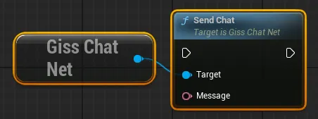
            
      2. 기존의 Print Chat 노드를 Send Chat 노드로 대체합니다.
   4. BP_ChatWidget 블루프린트 그래프의 최종 모습은 다음과 같습니다.
        
      

### 3.3. 채팅창 테스트

1. chat_server 프로젝트를 빌드하고 실행합니다.

2. 언리얼 엔진 프로젝트 레벨을 실행하고 채팅 기능을 확인합니다.
    
   
    
   

---

## 4. 미라지 캐릭터 구현하기

이 섹션에서는 향상된 게임플레이 기능을 가진 미라지 캐릭터를 구축합니다.

### 4.1. 미라지 블루프린트 캐릭터 추가

1. 두 개의 블루프린트 클래스를 복제합니다.
   1. 콘텐츠 브라우저에서 "All - 콘텐츠 - InfimaGames - FreeFPSTemplate - Core"로 이동합니다.
   2. 두 개의 블루프린트 클래스 BP_Character, ABP_Character를 복제합니다.
   3. 각각 BP_MirageCharacter, ABP_MirageCharacter로 이름을 변경합니다.

2. BP_MirageCharacter 블루프린트 에디터를 열고 아래 절차를 진행합니다.
   1. 컴포넌트 창에서 CharacterArms를 선택합니다.
   2. 애니메이션의 애님 클래스를 ABP_MirageCharacter로 변경합니다.
   3. 메시의 스켈레탈 메시 에셋을 SKM_Manny_Simple로 지정합니다.
    
   
    
3. BP_MirageCharacter를 레벨에 배치하고 실행하여 확인합니다.
    
   아래와 같은 모습으로 배치되면 현 시점 기준 정상입니다.
    

### 4.2. 이동 애니메이션 미러링

#### 4.2.1. 애니메이션 변수 복제

1. C++ 클래스 BaseMirageCharacter를 구현합니다.
   1. Character를 상속받는 BaseMirageCharacter 클래스를 생성합니다
   2. 생성된 클래스의 소스 코드를 수정합니다.
      - 수정 내역
        - BaseMirageCharacter.h
            
          ```diff
            // Fill out your copyright notice in the Description page of Project Settings.
            
            #pragma once
            
            #include "CoreMinimal.h"
            #include "GameFramework/Character.h"
            #include "BaseMirageCharacter.generated.h"
            
            UCLASS()
            class PDNUE5EXAMPLECLIENT_API ABaseMirageCharacter : public ACharacter
            {
            	GENERATED_BODY()
            
            public:
            	// Sets default values for this character's properties
            	ABaseMirageCharacter();
            
            protected:
            	// Called when the game starts or when spawned
            	virtual void BeginPlay() override;
            
            public:	
            	// Called every frame
            	virtual void Tick(float DeltaTime) override;
            
            	// Called to bind functionality to input
            	virtual void SetupPlayerInputComponent(class UInputComponent* PlayerInputComponent) override;
            
          + 	UFUNCTION(BlueprintCallable, BlueprintImplementableEvent)
          + 	void UpdateAnimationParameter(bool aiming, bool closeToWall, bool moving, bool running, float jumpVelocity, FVector3f mouseSwayLocation, FVector3f moveSwayLocation);
          + 
            };
            
          ```
            
      - 전체 코드
        - BaseMirageCharacter.h
            
          ```cpp
          // Fill out your copyright notice in the Description page of Project Settings.
          
          #pragma once
          
          #include "CoreMinimal.h"
          #include "GameFramework/Character.h"
          #include "BaseMirageCharacter.generated.h"
          
          UCLASS()
          class PDNUE5EXAMPLECLIENT_API ABaseMirageCharacter : public ACharacter
          {
          	GENERATED_BODY()
          
          public:
          	// Sets default values for this character's properties
          	ABaseMirageCharacter();
          
          protected:
          	// Called when the game starts or when spawned
          	virtual void BeginPlay() override;
          
          public:	
          	// Called every frame
          	virtual void Tick(float DeltaTime) override;
          
          	// Called to bind functionality to input
          	virtual void SetupPlayerInputComponent(class UInputComponent* PlayerInputComponent) override;
          
          	UFUNCTION(BlueprintCallable, BlueprintImplementableEvent)
          	void UpdateAnimationParameter(bool aiming, bool closeToWall, bool moving, bool running, float jumpVelocity, FVector3f mouseSwayLocation, FVector3f moveSwayLocation);
          
          };
          ```
            
2. BP_MirageCharacter의 부모 클래스로 BaseMirageCharacter를 지정합니다

3. 이벤트 함수를 사용한 애니메이션 변수 복제를 구현합니다.
   1. ABP_Character 블루프린트를 수정합니다.
      1. ABP_Character 블루프린트 에디터를 열고 이벤트 그래프 탭으로 이동합니다.
      2. BlueprintUpdateAnimation 이벤트 실행 흐름의 끝 부분으로 이동합니다.
        
         
        
      3. Get Actor Of Class 노드를 생성 및 연결하고 Class에 BP_MirageCharacter를 지정합니다.
      4. Update Animation Parameter 노드를 생성 및 연결하고 모든 변수를 연결합니다.
         모든 변수는 블루프린트의 변수 목록에서 가져올 수 있습니다.
            
         
            
         
            
   2. BP_MirageCharacter 블루프린트를 수정합니다.
      1. BP_MirageCharacter 블루프린트 에디터를 열고 이벤트 그래프 탭으로 이동합니다.
      2. 4개 변수를 추가합니다.
            
         
            
      3. Event UpdateAnimationParameter 노드를 추가합니다.
      4. 이벤트의 파라미터를 블루프린트 변수에 저장합니다.
            
         
            
      5. Event Tick 노드의 연결을 끊습니다.
            
         
            
   3. ABP_MirageCharacter 블루프린트를 수정합니다.
      1. ABP_MirageCharacter 블루프린트 에디터를 열고 이벤트 그래프 탭으로 이동합니다.
      2. Try Get Pawn Owner 노드를 추가합니다.
      3. Cast To BP_MirageCharacter 노드를 추가하고 연결합니다.
      4. 형변환된 캐릭터로부터 변수를 가져와 애니메이션 블루프린트 변수에 저장합니다.
        
         
        
4. 레벨 실행 및 애니메이션 복제 동작 확인
    
   달리기, 점프, 조준 등의 동작 시 모션을 따라하는 미라지 캐릭터의 모습을 관찰 가능합니다.
    
   

#### 4.2.2. 보정 애니메이션 적용

1. 보정 애니메이션 준비
   1. 애니메이션 파일을 다운로드 받습니다.
        
      [Invert.fbx](attachment:6af0f185-17bc-41be-8fcf-4ebf4e1a8d2e:Invert.fbx)
        
   2. 다운로드 받은 파일을 언리얼 에디터의 콘텐츠 브라우저로 드래그 합니다.
   3. Animations 탭의 스켈레톤 항목에 SKEL_UE5_Mannequin을 지정합니다.
        
      
        
   4. 임포트 버튼을 클릭합니다.
   5. 생성된 두 개의 애니메이션 중 하나를 삭제합니다. (선택 사항)
        
      
        
2. 보정 애니메이션을 수정합니다.
   1. Inver_Anim_Scene 애니메이션 시퀀스의 블루프린트 에디터를 엽니다.
   2. 에셋 디테일 창의 애디티브 세팅을 수정합니다.
      1. 애디티브 애님 타입 - Mesh Space 선택
      2. 베이스 포즈 타입 - Selected animation frame 선택
      3. 베이스 포즈 애니메이션 - A_FP_AssaultRifle_Idle_Loop 선택
        
         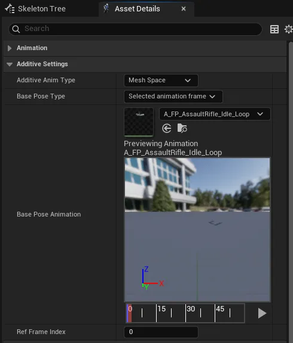
        
3. ABP_MirageCharacter 블루프린트 그래프를 수정합니다.
   1. Apply Additive 노드와 Invert_Anim_Scene 애니메이션 노드를 추가합니다.
   2. A_FP_AssaultRifle_Idle_Loop 애니메이션 노드와 연결합니다.
        
      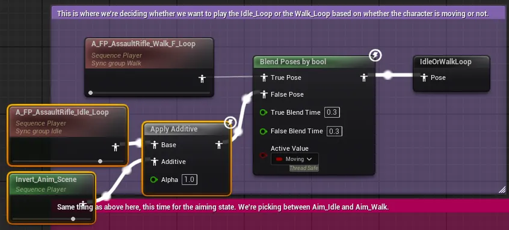
        
   3. 나머지 4개의 애니메이션 노드에 대해 같은 작업을 진행합니다.
        
      모두 동일하게 Inver_Anim_Scene, Apply Additive를 사용합니다.
        
      
        
4. 레벨 실행 및 애니메이션 보정 결과 확인
    
   팔 골격의 위치가 정상 범위 내로 보정 된 것을 확인할 수 있습니다.

   

#### 4.2.3. 이동 시 다리 애니메이션 적용

1. ABP_MirageCharacter - AnimGraph 블루프린트 그래프의 A_FP_AssaultRifle_Run_Loop와 연결된 부분을 아래의 절차에 따라 수정합니다.
   1. Layered blend per bone 노드를 추가합니다.
   2. 추가한 노드의 디테일을 수정합니다.
      1. 설정 - 레이어 설정 - 인덱스[0]에 두 개의 분기 필터를 추가합니다.
      2. 각각 본 이름을 thigh_l, thigh_r로 지정합니다.
        
         
        
   3. 기존 Apply Additive 노드를 위 노드의 Base Pose에 연결합니다.
   4. MM_Run_Fwd 애니메이션 노드를 추가하고 위 노드의 Blend Poses 0에 연결합니다.
   5. MM_Run_Fwd 노드의 디테일 창에서 애니메이션 루프를 활성화 합니다.
        
      
        
   6. 최종 모습은 다음과 같습니다.
        
      코멘트 노드의 크기 조절은 선택 사항입니다.
        
      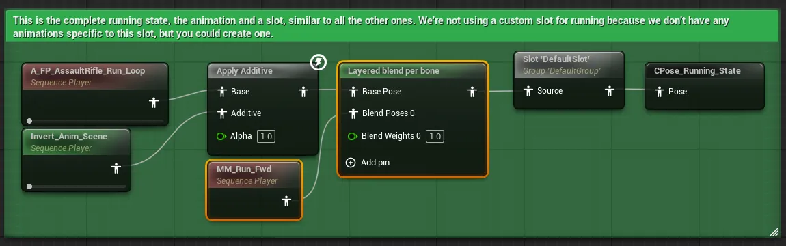
        
2. 위 과정을 나머지 4개의 애니메이션 노드에도 유사하게 적용합니다.
   1. Layered blend per bone 노드의 설정은 동일하므로 복사하여 사용할 수 있습니다.
   2. MM_Run_Fwd 노드 대신 경우에 MM_Walk_Fwd 또는 MM_Idle을 사용해야 합니다.
   3. 모든 과정을 마친 후 그래프는 다음과 같습니다.
        
      
        
      
        
3. 레벨 실행 및 다리 애니메이션 적용 확인
    
   걷기와 달리기 애니메이션이 재생됨을 확인할 수 있습니다.

   

### 4.3. 액션 애니메이션 및 동작 복제

1. BaseMirageCharacter 클래스의 소스 코드를 수정합니다.
   - 수정 내역
     - BaseMirageCharacter.h
            
       ```diff
         // Fill out your copyright notice in the Description page of Project Settings.
         
         #pragma once
         
         #include "CoreMinimal.h"
         #include "GameFramework/Character.h"
         #include "BaseMirageCharacter.generated.h"
         
         UCLASS()
         class PDNUE5EXAMPLECLIENT_API ABaseMirageCharacter : public ACharacter
         {
         	GENERATED_BODY()
         
         public:
         	// Sets default values for this character's properties
         	ABaseMirageCharacter();
         
         protected:
         	// Called when the game starts or when spawned
         	virtual void BeginPlay() override;
         
         public:	
         	// Called every frame
         	virtual void Tick(float DeltaTime) override;
         
         	// Called to bind functionality to input
         	virtual void SetupPlayerInputComponent(class UInputComponent* PlayerInputComponent) override;
         
         	UFUNCTION(BlueprintCallable, BlueprintImplementableEvent)
         	void UpdateAnimationParameter(bool aiming, bool closeToWall, bool moving, bool running, float jumpVelocity, FVector3f mouseSwayLocation, FVector3f moveSwayLocation);
         
       + 	UFUNCTION(BlueprintCallable, BlueprintImplementableEvent)
       + 	void OnFired();
       + 
       + 	UFUNCTION(BlueprintCallable, BlueprintImplementableEvent)
       + 	void OnReloaded();
       + 
         };
         
       ```
            
   - 전체 코드
     - BaseMirageCharacter.h
            
       ```cpp
       // Fill out your copyright notice in the Description page of Project Settings.
       
       #pragma once
       
       #include "CoreMinimal.h"
       #include "GameFramework/Character.h"
       #include "BaseMirageCharacter.generated.h"
       
       UCLASS()
       class PDNUE5EXAMPLECLIENT_API ABaseMirageCharacter : public ACharacter
       {
       	GENERATED_BODY()
       
       public:
       	// Sets default values for this character's properties
       	ABaseMirageCharacter();
       
       protected:
       	// Called when the game starts or when spawned
       	virtual void BeginPlay() override;
       
       public:	
       	// Called every frame
       	virtual void Tick(float DeltaTime) override;
       
       	// Called to bind functionality to input
       	virtual void SetupPlayerInputComponent(class UInputComponent* PlayerInputComponent) override;
       
       	UFUNCTION(BlueprintCallable, BlueprintImplementableEvent)
       	void UpdateAnimationParameter(bool aiming, bool closeToWall, bool moving, bool running, float jumpVelocity, FVector3f mouseSwayLocation, FVector3f moveSwayLocation);
       
       	UFUNCTION(BlueprintCallable, BlueprintImplementableEvent)
       	void OnFired();
       
       	UFUNCTION(BlueprintCallable, BlueprintImplementableEvent)
       	void OnReloaded();
       
       };
       ```
            
2. BP_Character 블루프린트 그래프를 수정합니다.
   1. 재장전 시 미라지 캐릭터의 재장전 이벤트를 호출하는 그래프를 작성합니다.
      1. 그래프 상단에서 Reload와 관련된 구역으로 이동합니다.
            
         
            
      2. Get Actor Of Class 노드를 생성하고 클래스에 BP_MirageCharacter를 지정합니다.
      3. On Reloaded 함수 노드로 연계합니다.
            
         
            
      4. Reload와 Delay 함수 사이로 연결합니다.
            
         
            
   2. 발사 시 미라지 캐릭터의 발사 이벤트를 호출하는 그래프를 작성합니다.
      1. 그래프 우측에서 Shoot과 관련된 구역의 종단부로 이동합니다.
            
         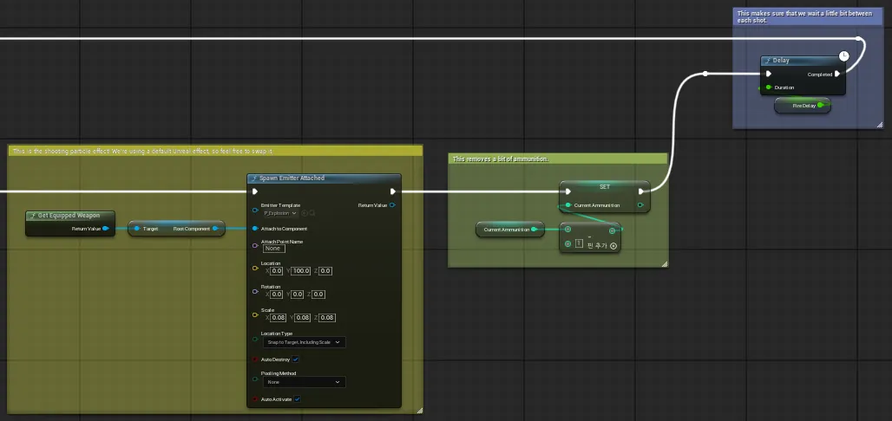
            
      2. Get Actor Of Class 노드를 생성하고 클래스에 BP_MirageCharacter를 지정합니다.
      3. On Fired 함수 노드로 연계합니다.
      4. (Current Ammunition) Set 과 Delay 함수 사이로 연결합니다.
            
         
            
3. BP_MirageCharacter 블루프린트 그래프를 수정합니다.
   1. 그래프 상단에서 Reload와 관련된 구역으로 이동합니다.
   2. Play Montage 노드의 앞에 On Reloaded 이벤트 노드를 연결합니다
        
      
        
   3. 그래프 우측에서 Shoot과 관련된 구역으로 이동합니다.
   4. Shoot 노드의 앞에 On Fired 이벤트 노드를 연결합니다
        
      
        
4. 레벨을 실행하고 미라지 캐릭터가 장전과 발사를 따라하는 모습을 볼 수 있습니다.
    
   

### 4.4. 위치, 회전 등 기타 복제

1. BaseMirageCharacter 클래스의 소스 코드를 수정합니다.
   - 수정 내역
     - BaseMirageCharacter.h
            
       ```diff
         // Fill out your copyright notice in the Description page of Project Settings.
         
         #pragma once
         
         #include "CoreMinimal.h"
         #include "GameFramework/Character.h"
         #include "BaseMirageCharacter.generated.h"
         
         UCLASS()
         class PDNUE5EXAMPLECLIENT_API ABaseMirageCharacter : public ACharacter
         {
         	GENERATED_BODY()
         
         public:
         	// Sets default values for this character's properties
         	ABaseMirageCharacter();
         
         protected:
         	// Called when the game starts or when spawned
         	virtual void BeginPlay() override;
         
         public:	
         	// Called every frame
         	virtual void Tick(float DeltaTime) override;
         
         	// Called to bind functionality to input
         	virtual void SetupPlayerInputComponent(class UInputComponent* PlayerInputComponent) override;
         
       + 	UFUNCTION(BlueprintCallable, BlueprintImplementableEvent)
       + 	void UpdateTransform(FVector3f position, FQuat4f orientation, FVector3f linearVelocity, FVector3f angularVelocity, float aimPitch);
       + 
         	UFUNCTION(BlueprintCallable, BlueprintImplementableEvent)
         	void UpdateAnimationParameter(bool aiming, bool closeToWall, bool moving, bool running, float jumpVelocity, FVector3f mouseSwayLocation, FVector3f moveSwayLocation);
         
         	UFUNCTION(BlueprintCallable, BlueprintImplementableEvent)
         	void OnFired();
         
         	UFUNCTION(BlueprintCallable, BlueprintImplementableEvent)
         	void OnReloaded();
         
         };
         
       ```
            
   - 전체 코드
     - BaseMirageCharacter.h
            
       ```cpp
       // Fill out your copyright notice in the Description page of Project Settings.
       
       #pragma once
       
       #include "CoreMinimal.h"
       #include "GameFramework/Character.h"
       #include "BaseMirageCharacter.generated.h"
       
       UCLASS()
       class PDNUE5EXAMPLECLIENT_API ABaseMirageCharacter : public ACharacter
       {
       	GENERATED_BODY()
       
       public:
       	// Sets default values for this character's properties
       	ABaseMirageCharacter();
       
       protected:
       	// Called when the game starts or when spawned
       	virtual void BeginPlay() override;
       
       public:	
       	// Called every frame
       	virtual void Tick(float DeltaTime) override;
       
       	// Called to bind functionality to input
       	virtual void SetupPlayerInputComponent(class UInputComponent* PlayerInputComponent) override;
       
       	UFUNCTION(BlueprintCallable, BlueprintImplementableEvent)
       	void UpdateTransform(FVector3f position, FQuat4f orientation, FVector3f linearVelocity, FVector3f angularVelocity, float aimPitch);
       
       	UFUNCTION(BlueprintCallable, BlueprintImplementableEvent)
       	void UpdateAnimationParameter(bool aiming, bool closeToWall, bool moving, bool running, float jumpVelocity, FVector3f mouseSwayLocation, FVector3f moveSwayLocation);
       
       	UFUNCTION(BlueprintCallable, BlueprintImplementableEvent)
       	void OnFired();
       
       	UFUNCTION(BlueprintCallable, BlueprintImplementableEvent)
       	void OnReloaded();
       
       };
       ```
            
2. BP_Character 블루프린트 그래프를 수정합니다.
   1. 플로트 타입의 AimPitch 변수를 추가합니다.
        
      
        
   2. Tick 이벤트의 코드가 끝나는 부분으로 이동합니다.
   3. 두 개의 라우트 노드를 생성하고 Branch 노드의 False, Stop Running 두 노드를 연결합니다.
        
      
        
      
        
   4. 라우트 노드를 이동합니다.
        
      
        
   5. BP_MirageCharacter의 Update Transform을 호출하는 그래프를 작성합니다
        
      그래프 작성이 끝난 모습은 다음과 같으며, 아래에서 과정을 확인할 수 있습니다.
        
      
        
      - 과정 보기
        1. Get Actor Of Class 노드를 생성하고 클래스에 BP_MirageCharacter를 지정합니다.
        2. Update Transform 함수 노드로 연계합니다.
                
           
                
        3. Get Actor Location, Get Actor Rotation으로 이동/회전 값을 얻는 노드를 생성합니다.
                
           
                
        4. Get Actor Rotation은 To Quaternion 노드로 연계합니다.
                
           
                
        5. Get Character Arms 노드를 생성하고, 속도와 각속도를 얻는 노드로 연계합니다.
                
           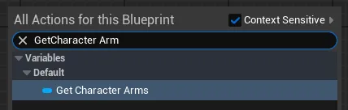
                
           
                
        6. Get Control Rotation 노드를 생성하고, 반환값으로 부터 Pitch 회전 값을 연산합니다.
           모든 노드는 노드 이름을 통해 연계 가능합니다.
           중간의 곱셉 노드는 Multiply로 생성 가능합니다.
                
           
                
        7. 추가된 모든 노드를 Update Transform의 알맞은 인자와 연결합니다.
           Get Physics Linear Velocity 노드는 실행 핀이 연결되어야 합니다.

3. BP_MirageCharacter 블루프린트 그래프를 수정합니다.
   1. 플로트 형식의 AimPitch 변수를 추가합니다.
   2. UpdateTransform 이벤트 노드를 추가합니다.
   3. 이벤트 노드에 맞는 각 노드를 추가하고 연결합니다.
        
      
        
   4. Position 노드의 연결을 끊고, Make Vector노드를 추가하여 연결합니다.
        
      싱글 테스트 환경에서의 버그동작을 방지하기 위한 조치입니다.
        
      
        
   5. Shoot과 관련된 부분으로 이동합니다.
   6. 아래와 같이 그래프를 구성하고 연결합니다.
        
      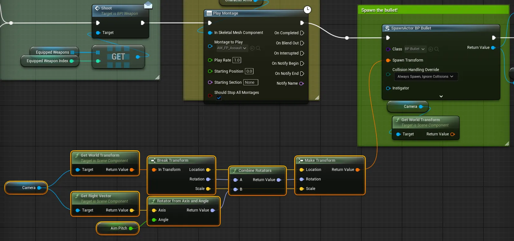
        
4. ABP_MirageCharacter 블루프린트의 이벤트그래프를 수정합니다.
   1. 플로트 형식의 AimPitch 변수를 추가합니다.
   2. 형변환된 BP_MirageCharacter로부터 값을 불러와 저장합니다.
        
      
        
5. ABP_MirageCharacter 블루프린트의 AnimGraph를 수정합니다.
   1. Mouse Sway 관련 부분으로 이동합니다.
        
      
        
   2. Trasnform (Modify) Bone 노드를 추가하고 Mouse Sway 코멘트 노드의 앞에 연결합니다.
   3. AimPitch 변수값으로 Rotator를 만들고 노드의 Rotation에 적용합니다.
        
      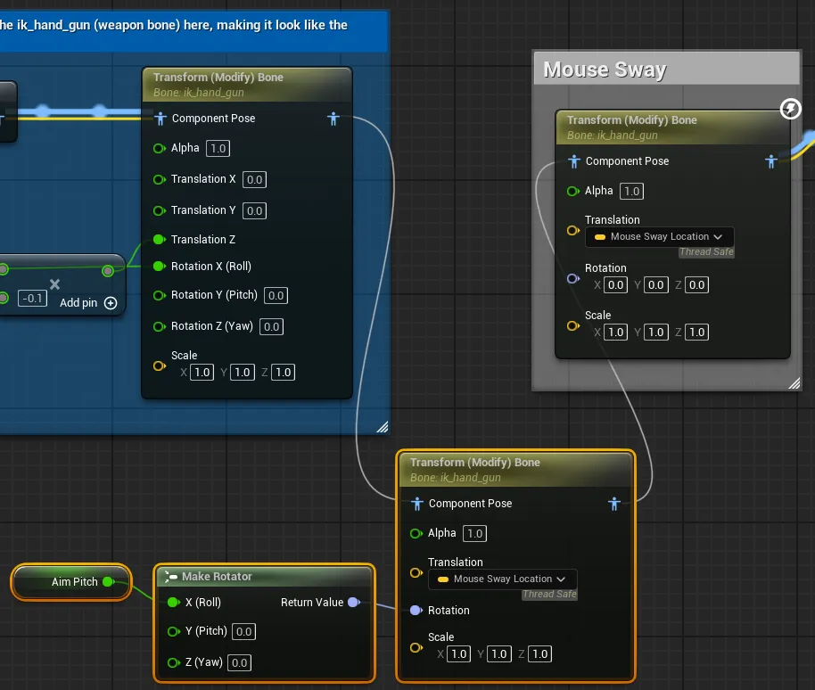
        
6. 레벨을 실행하고 기능을 테스트합니다.
    
   미라지 캐릭터가 플레이어 캐릭터와 같은 방향을 조준하며 발사하게 되었습니다.

   

---

## 5. 미라지 캐릭터 온라인 연동하기

이 섹션에서는 멀티플레이어 게임플레이를 위한 미라지 캐릭터와 ProudNet 네트워킹 통합을 다룹니다.

### 5.1. Visual Studio 프로젝트 작업

#### 5.1.1. game_server 프로젝트 생성

1. VisualStudio에서 빈 프로젝트 game_server를 생성합니다

2. game_server프로젝트에 3개의 새 항목 main.cpp, setting.cpp, setting.h을 추가합니다.

3. game_server 프로젝트의 속성을 수정합니다.
   1. "C/C++ - 언어 - C++ 언어 표준"
      드롭다운에서 "ISO C++20 표준 (/std:C++20)" 선택
   2. "C/C++ - 일반 - 추가 포함 디렉터리"
      드롭다운에서 <편집…> 선택
      팝업 창에 아래 경로 추가
      ```
      C:\Program Files (x86)\Nettention\ProudNet\include
      ```
   3. "링커 - 일반 - 추가 라이브러리 디렉터리"
      드롭다운에서 <편집…> 선택
      팝업 창에 아래 경로 추가
      ```
      C:\Program Files (x86)\Nettention\ProudNet\lib\$(Platform)\v140\$(Configuration)
      ```
   4. "링커 - 입력 - 추가 종속성"
      드롭다운에서 <편집…> 선택
      팝업 창에 아래 파일명 추가
      ```
      ProudNetServer.lib
      ProudNetClient.lib
      ```
   5. "빌드 이벤트 - 빌드 후 이벤트 - 명령줄"
      드롭다운에서 <편집…> 선택
      팝업 창에 아래 명령 추가
      ```
      xcopy /Y "C:\Program Files (x86)\Nettention\ProudNet\lib\$(Platform)\v140\$(Configuration)\libcrypto-3-x64.dll" "$(OutDir)"
      xcopy /Y "C:\Program Files (x86)\Nettention\ProudNet\lib\$(Platform)\v140\$(Configuration)\libssl-3-x64.dll" "$(OutDir)"
      ```

4. 각 소스 파일에 코드를 입력합니다.
   - 전체 코드
     - setting.h
       ```cpp
       #pragma once

       namespace ProudSetting
       {
           namespace GAME
           {
               extern const ::Proud::Guid version;
               extern const int server_port;
           }
       }
       ```

     - setting.cpp
       ```cpp
       #include <ProudNetClient.h>
       #include "setting.h"

       namespace ProudSetting
       {
           namespace GAME
           {
               const ::Proud::PNGUID guid = { 0x3ae33249, 0xecc6, 0x4980, { 0xbc, 0x5d, 0x7b, 0xa, 0x99, 0x9c, 0x7, 0x39 } };
               const ::Proud::Guid version = ::Proud::Guid(guid);
               const int server_port = 33338;
           }
       }
       ```

     - main.cpp
       ```cpp
       #include <iostream>
       #include <format>
       #include <memory>

       #include <ProudNetServer.h>
       #include "setting.h"

       std::shared_ptr<Proud::CNetServer> net_server;

       int main()
       {
       	net_server = std::shared_ptr<Proud::CNetServer>(Proud::CNetServer::Create());

       	net_server->OnClientJoin = [](Proud::CNetClientInfo* clientInfo)
       		{
       			std::cout << "Client[" << (int)clientInfo->m_HostID << "] connected.\n";
       		};
       	net_server->OnClientLeave = [](Proud::CNetClientInfo* clientInfo, Proud::ErrorInfo* error, const Proud::ByteArray byte_arr)
       		{
       			std::cout << "Client[" << (int)clientInfo->m_HostID << "] disconnected.\n";
       		};

       	Proud::CStartServerParameter start_param;
       	start_param.m_protocolVersion = ProudSetting::GAME::version;
       	start_param.m_tcpPorts.Add(ProudSetting::GAME::server_port);

       	try
       	{
       		net_server->Start(start_param);
       	}
       	catch (Proud::Exception& error)
       	{
       		std::cout << "Server start failed: " << error.what() << endl;
       		return 0;
       	}

       	std::cout << ("Server started. Enterable commands:\n");
       	std::cout << ("-q : Quit.\n");
       	std::string input;
       	while (true)
       	{
       		std::cin >> input;
       		if (input[0] == '-')
       		{
       			if (input == "-q")
       				break;
       		}
       	}

       	std::cout << "Stopping server...\n";
       	net_server->Stop();
       	net_server = nullptr;
       	std::cout << "Server stopped.\n";
       	return 0;
       }
       ```

#### 5.1.2. game_pidl 프로젝트 생성

1. PdnUE5ExampleServer에서 새로운 빈 프로젝트 game_pidl을 추가합니다.

2. 파일 P2P.PIDL을 추가하고, 속성을 수정합니다.
   1. "일반 - 항목 형식"
      드롭다운에서 "사용자 지정 빌드 도구" 선택
   2. "사용자 지정 빌드 도구 - 일반 - 명령줄"
      텍스트 입력
      ```
      C:\"Program Files (x86)"\Nettention\ProudNet\util\PIDL.exe "%(FullPath)" -cpp
      ```
   3. "사용자 지정 빌드 도구 - 일반 - 설명"
      텍스트 입력
      ```
      %(Filename).PIDL Compiling...
      ```
   4. "사용자 지정 빌드 도구 - 일반 - 출력"
      드롭다운에서 <편집…> 선택
      팝업 창에 아래 경로 추가
      ```
      %(RootDir)%(Directory)\%(Filename)_common.cpp
      %(RootDir)%(Directory)\%(Filename)_common.h
      %(RootDir)%(Directory)\%(Filename)_proxy.cpp
      %(RootDir)%(Directory)\%(Filename)_proxy.h
      %(RootDir)%(Directory)\%(Filename)_stub.cpp
      %(RootDir)%(Directory)\%(Filename)_stub.h
      ```

3. 파일에 코드를 입력합니다.
   - 전체 코드
     - P2P.PIDL
       ```pidl
       [access=public]
       global GAME_P2P 3000
       {
           Transform([in] Proud::CharacterTransformData transformData);
           AnimationParams([in] Proud::CharacterAnimationParams animationParams);
           Action([in] Proud::CharacterAction actionId);
       }
       ```

4. game_pidl 프로젝트를 빌드합니다.

#### 5.1.3. game_server 프로젝트 소스 코드 수정

1. game_server 프로젝트의 소스 코드를 수정합니다.
   - 수정 내역
     - main.cpp
       ```diff
         #include <iostream>
         #include <format>
         #include <memory>
         
         #include <ProudNetServer.h>
         #include "setting.h"
         
       + Proud::HostID group_host_id = Proud::HostID_None;
       + 
         std::shared_ptr<Proud::CNetServer> net_server;
         
         int main()
         {
         	net_server = std::shared_ptr<Proud::CNetServer>(Proud::CNetServer::Create());
         
         	net_server->OnClientJoin = [](Proud::CNetClientInfo* clientInfo)
         		{
         			std::cout << "Client[" << (int)clientInfo->m_HostID << "] connected.\n";
       + 
       + 			Proud::HostID list[100];
       + 			int listCount = net_server->GetClientHostIDs(list, 100);
       + 			group_host_id = net_server->CreateP2PGroup(list, listCount, Proud::ByteArray());
         		};
         	net_server->OnClientLeave = [](Proud::CNetClientInfo* clientInfo, Proud::ErrorInfo* error, const Proud::ByteArray byte_arr)
         		{
         			std::cout << "Client[" << (int)clientInfo->m_HostID << "] disconnected.\n";
         		};
         
         	Proud::CStartServerParameter start_param;
         	start_param.m_protocolVersion = ProudSetting::GAME::version;
         	start_param.m_tcpPorts.Add(ProudSetting::GAME::server_port);
         
         	try
         	{
         		net_server->Start(start_param);
         	}
         	catch (Proud::Exception& error)
         	{
         		std::cout << "Server start failed: " << error.what() << endl;
         		return 0;
         	}
         
         	std::cout << ("Server started. Enterable commands:\n");
         	std::cout << ("-q : Quit.\n");
         	std::string input;
         	while (true)
         	{
         		std::cin >> input;
         		if (input[0] == '-')
         		{
         			if (input == "-q")
         				break;
         		}
         	}
         
         	std::cout << "Stopping server...\n";
         	net_server->Stop();
         	net_server = nullptr;
         	std::cout << "Server stopped.\n";
         	return 0;
         }
       ```

     - setting.h에 데이터 구조체 추가
       ```diff
         #pragma once
         
         namespace ProudSetting
         {
             namespace GAME
             {
                 extern const ::Proud::Guid version;
                 extern const int server_port;
             }
         }
         
       + namespace Proud
       + {
       +     struct float3
       +     {
       +         float3() = default;
       +         float3(float x, float y, float z) : x(x), y(y), z(z) {};
       +         float x, y, z;
       +     };
       +     Proud::CMessage& operator>> (Proud::CMessage& a, float3& b);
       +     Proud::CMessage& operator<<(Proud::CMessage& a, const float3& b);
       + 
       +     struct float4
       +     {
       +         float4() = default;
       +         float4(float x, float y, float z, float w) : x(x), y(y), z(z), w(w) {};
       +         float x, y, z, w;
       +     };
       +     Proud::CMessage& operator>> (Proud::CMessage& a, float4& b);
       +     Proud::CMessage& operator<<(Proud::CMessage& a, const float4& b);
       + 
       +     struct CharacterTransformData
       +     {
       +         float3 pos;
       +         float4 ori;
       + 
       +         float3 linear_velocity, angular_velocity;
       +         float aim_angle; // degree of depression
       +     };
       + 
       +     void AppendTextOut(String& a, Proud::CharacterTransformData& b);
       +     Proud::CMessage& operator>> (Proud::CMessage& a, CharacterTransformData& b);
       +     Proud::CMessage& operator<<(Proud::CMessage& a, const CharacterTransformData& b);
       + 
       +     struct CharacterAnimationParams
       +     {
       +         bool aiming, moving, running, close_to__wall;
       +         float jump_velocity;
       +         float3 mouse_sway_loc, move_sway_loc;
       +     };
       + 
       +     void AppendTextOut(String& a, Proud::CharacterAnimationParams& b);
       +     Proud::CMessage& operator>> (Proud::CMessage& a, CharacterAnimationParams& b);
       +     Proud::CMessage& operator<<(Proud::CMessage& a, const CharacterAnimationParams& b);
       + 
       +     enum class CharacterAction : int
       +     {
       +         Shoot,
       +         Reload,
       +     };
       + 
       +     void AppendTextOut(String& a, const Proud::CharacterAction& b);
       +     Proud::CMessage& operator>> (Proud::CMessage& a, CharacterAction& b);
       +     Proud::CMessage& operator<<(Proud::CMessage& a, const CharacterAction& b);
       + }
       ```

     - setting.cpp에 직렬화 구현 추가
       ```diff
         #include <ProudNetClient.h>
         #include "setting.h"
         
         namespace ProudSetting
         {
             namespace GAME
             {
                 const ::Proud::PNGUID guid = { 0x3ae33249, 0xecc6, 0x4980, { 0xbc, 0x5d, 0x7b, 0xa, 0x99, 0x9c, 0x7, 0x39 } };
                 const ::Proud::Guid version = ::Proud::Guid(guid);
                 const int server_port = 33338;
             }
         }
         
       + #include <format>
       + 
       + namespace std
       + {
       +     template<>
       +     struct formatter<Proud::float3, char>
       +     {
       +         std::formatter<float, char> float_fmt;
       +         constexpr auto parse(std::format_parse_context& ctx)
       +         {
       +             return float_fmt.parse(ctx);
       +         }
       +         auto format(const Proud::float3& v, std::format_context& ctx) -> decltype(ctx.out())
       +         {
       +             return std::format_to(ctx.out(), "{}, {}, {}", v.x, v.y, v.z);
       +         }
       +     };
       +     template<>
       +     struct formatter<Proud::float4, char>
       +     {
       +         std::formatter<float, char> float_fmt;
       +         constexpr auto parse(std::format_parse_context& ctx)
       +         {
       +             return float_fmt.parse(ctx);
       +         }
       +         auto format(const Proud::float4& v, std::format_context& ctx) -> decltype(ctx.out())
       +         {
       +             return std::format_to(ctx.out(), "{}, {}, {}, {}", v.x, v.y, v.z, v.w);
       +         }
       +     };
       + }
       + 
       + namespace Proud
       + {
       +     Proud::CMessage& operator>>(Proud::CMessage& a, float3& b) { return a >> b.x >> b.y >> b.z; }
       +     Proud::CMessage& operator<<(Proud::CMessage& a, const float3& b) { return a << b.x << b.y << b.z; }
       +     Proud::CMessage& operator>>(Proud::CMessage& a, float4& b) { return a >> b.x >> b.y >> b.z >> b.w; }
       +     Proud::CMessage& operator<<(Proud::CMessage& a, const float4& b) { return a << b.x << b.y << b.z << b.w; }
       + 
       +     void AppendTextOut(String& a, Proud::CharacterTransformData& b) {}
       + 
       +     CMessage& operator>>(CMessage& a, Proud::CharacterTransformData& b)
       +     {
       +         a >> b.pos >> b.ori;
       +         a >> b.linear_velocity >> b.angular_velocity;
       +         a >> b.aim_angle;
       +         return a;
       +     }
       + 
       +     CMessage& operator<<(CMessage& a, const Proud::CharacterTransformData& b)
       +     {
       +         a << b.pos << b.ori;
       +         a << b.linear_velocity << b.angular_velocity;
       +         a << b.aim_angle;
       +         return a;
       +     }
       + 
       +     void AppendTextOut(String& a, Proud::CharacterAnimationParams& b) {}
       + 
       +     Proud::CMessage& operator>>(Proud::CMessage& a, CharacterAnimationParams& b)
       +     {
       +         a >> b.aiming >> b.moving >> b.running >> b.close_to__wall;
       +         a >> b.jump_velocity;
       +         a >> b.mouse_sway_loc.x >> b.mouse_sway_loc.y >> b.mouse_sway_loc.z;
       +         a >> b.move_sway_loc.x >> b.move_sway_loc.y >> b.move_sway_loc.z;
       +         return a;
       +     }
       + 
       +     Proud::CMessage& operator<<(Proud::CMessage& a, const CharacterAnimationParams& b)
       +     {
       +         a << b.aiming << b.moving << b.running << b.close_to__wall;
       +         a << b.jump_velocity;
       +         a << b.mouse_sway_loc.x << b.mouse_sway_loc.y << b.mouse_sway_loc.z;
       +         a << b.move_sway_loc.x << b.move_sway_loc.y << b.move_sway_loc.z;
       +         return a;
       +     }
       + 
       +     void AppendTextOut(String& a, const CharacterAction& b) {}
       + 
       +     Proud::CMessage& operator>>(Proud::CMessage& a, CharacterAction& b)
       +     {
       +         int buffer;
       +         a >> buffer;
       +         b = static_cast<Proud::CharacterAction>(buffer);
       +         return a;
       +     }
       + 
       +     Proud::CMessage& operator<<(Proud::CMessage& a, const CharacterAction& b)
       +     {
       +         return a << static_cast<int>(b);
       +     }
               + }
        ```

### 5.2. 언리얼 프로젝트 작업

1. GissGameNet C++ 클래스 생성
   1. GameInstanceSubsystem을 상속받는 C++ 클래스 GissGameNet을 생성합니다.
   2. GissGameNet 클래스의 소스 코드를 수정합니다.
      - 수정 내역
        - GissGameNet.h
            
          ```diff
            // Fill out your copyright notice in the Description page of Project Settings.
            
            #pragma once
            
            #include "CoreMinimal.h"
            #include "Subsystems/GameInstanceSubsystem.h"
            #include "GissGameNet.generated.h"
            
            /**
             * 
             */
            UCLASS()
            class PDNUE5EXAMPLECLIENT_API UGissGameNet : public UGameInstanceSubsystem
            {
            	GENERATED_BODY()
            	
          + public:
          + 	UFUNCTION(BlueprintCallable)
          + 	void UpdateCharacterTransform(FVector3f position, FQuat4f rotation, FVector3f linearVelocity, FVector3f angularVelocity, float aimPitch);
          + 
          + 	UFUNCTION(BlueprintCallable)
          + 	void UpdateCharacterAnimationParameter(bool aiming, bool closeToWall, bool moving, bool running, float jumpVelocity, FVector3f mouseSwayLocation, FVector3f moveSwayLocation);
          + 
          + 	UFUNCTION(BlueprintCallable)
          + 	void SendCharacterFired();
          + 
          + 	UFUNCTION(BlueprintCallable)
          + 	void SendCharacterReloaded();
          + 
          + private:
          + 	virtual void Initialize(FSubsystemCollectionBase& Collection) override;
          + 	virtual void Deinitialize() override;
            };
          ```
            
        - GissGameNet.cpp (주요 구현 부분만 표시)
            
          ```diff
            // Fill out your copyright notice in the Description page of Project Settings.
            
            #include "GissGameNet.h"
            
          + #include <format>
          + #include <functional>
          + 
          + #include <ProudNetClient.h>
          + #include "C:/proudnet_ue5_example/PdnUE5ExampleServer/game_server/setting.h"
          + #include "C:/proudnet_ue5_example/PdnUE5ExampleServer/game_server/setting.cpp"
          + 
          + #include "C:/proudnet_ue5_example/PdnUE5ExampleServer/game_pidl/P2P_common.h"
          + #include "C:/proudnet_ue5_example/PdnUE5ExampleServer/game_pidl/P2P_common.cpp"
          + #include "C:/proudnet_ue5_example/PdnUE5ExampleServer/game_pidl/P2P_proxy.h"
          + #include "C:/proudnet_ue5_example/PdnUE5ExampleServer/game_pidl/P2P_proxy.cpp"
          + #include "C:/proudnet_ue5_example/PdnUE5ExampleServer/game_pidl/P2P_stub.h"
          + #include "C:/proudnet_ue5_example/PdnUE5ExampleServer/game_pidl/P2P_stub.cpp"
          + 
          + #include "Kismet/GameplayStatics.h"
          + #include "BaseMirageCharacter.h"
          + 
          + // P2P 통신 및 네트워킹 코드 구현...
          ```
            
      - 전체 코드 (GissGameNet.cpp는 상당히 길므로 주요 함수들만 명시)
        - GissGameNet.h
            
          ```cpp
          // Fill out your copyright notice in the Description page of Project Settings.
          
          #pragma once
          
          #include "CoreMinimal.h"
          #include "Subsystems/GameInstanceSubsystem.h"
          #include "GissGameNet.generated.h"
          
          /**
           * 
           */
          UCLASS()
          class PDNUE5EXAMPLECLIENT_API UGissGameNet : public UGameInstanceSubsystem
          {
          	GENERATED_BODY()
          
          public:
          	UFUNCTION(BlueprintCallable)
          	void UpdateCharacterTransform(FVector3f position, FQuat4f rotation, FVector3f linearVelocity, FVector3f angularVelocity, float aimPitch);
          
          	UFUNCTION(BlueprintCallable)
          	void UpdateCharacterAnimationParameter(bool aiming, bool closeToWall, bool moving, bool running, float jumpVelocity, FVector3f mouseSwayLocation, FVector3f moveSwayLocation);
          
          	UFUNCTION(BlueprintCallable)
          	void SendCharacterFired();
          
          	UFUNCTION(BlueprintCallable)
          	void SendCharacterReloaded();
          
          private:
          	virtual void Initialize(FSubsystemCollectionBase& Collection) override;
          	virtual void Deinitialize() override;
          };
          ```

2. BP_Character 블루프린트 그래프를 수정합니다.
   1. BP_MirageCharacter의 Update Transform을 호출하는 그래프를 GissGameNet의 Update Character Transform을 호출하는 그래프로 대체합니다.
        
      
        
   2. BP_MirageCharacter의 On Fired를 호출하는 그래프를 GissGameNet의 Send Character Fired를 호출하는 그래프로 대체합니다.
        
      
        
   3. BP_MirageCharacter의 On Reloaded를 호출하는 그래프를 GissGameNet의 Send Character Reloaded를 호출하는 그래프로 대체합니다.
        
      
        
3. ABP_Character 블루프린트의 이벤트그래프를 수정합니다.
   1. BP_MirageCharacter의 Update Animation Parameter를 호출하는 그래프를 GissGameNet의 Update Character Animation Parameter를 호출하는 그래프로 대체합니다.
        
      
        
4. 서버 빌드 및 실행 후 레벨 실행 시, 연동 작업 이전과 동일한 결과를 확인할 수 있습니다.

---

## 6. 마무리 후 프로젝트 빌드 및 테스트

이 섹션에서는 프로젝트 마무리, 빌드 및 종합 테스트 절차를 다룹니다.

### 6.1. 테스트 코드 수정

1. BaseMirageCharacter 클래스 코드를 수정합니다.
   - 수정 내역
     - BaseMirageCharacter.h
            
       ```diff
         // Fill out your copyright notice in the Description page of Project Settings.
         
         #pragma once
         
         #include "CoreMinimal.h"
         #include "GameFramework/Character.h"
         #include "BaseMirageCharacter.generated.h"
         
         UCLASS()
         class PDNUE5EXAMPLECLIENT_API ABaseMirageCharacter : public ACharacter
         {
         	GENERATED_BODY()
         
         public:
         	// Sets default values for this character's properties
         	ABaseMirageCharacter();
         
         protected:
         	// Called when the game starts or when spawned
         	virtual void BeginPlay() override;
         
         public:	
         	// Called every frame
         	virtual void Tick(float DeltaTime) override;
         
         	// Called to bind functionality to input
         	virtual void SetupPlayerInputComponent(class UInputComponent* PlayerInputComponent) override;
         
         	UFUNCTION(BlueprintCallable, BlueprintImplementableEvent)
         	void UpdateTransform(FVector3f position, FQuat4f orientation, FVector3f linearVelocity, FVector3f angularVelocity, float aimPitch);
         
         	UFUNCTION(BlueprintCallable, BlueprintImplementableEvent)
         	void UpdateAnimationParameter(bool aiming, bool closeToWall, bool moving, bool running, float jumpVelocity, FVector3f mouseSwayLocation, FVector3f moveSwayLocation);
         
         	UFUNCTION(BlueprintCallable, BlueprintImplementableEvent)
         	void OnFired();
         
         	UFUNCTION(BlueprintCallable, BlueprintImplementableEvent)
         	void OnReloaded();
         
       + 	UFUNCTION(BlueprintCallable)
       + 	void SetId(int id);
       + 
       + 	UFUNCTION(BlueprintCallable)
       + 	int GetId() const;
       + 
       + private:
       + 	int id;
         };
         
       ```
            
     - BaseMirageCharacter.cpp
            
       ```diff
         // Fill out your copyright notice in the Description page of Project Settings.
         
         
         #include "BaseMirageCharacter.h"
         
         // Sets default values
         ABaseMirageCharacter::ABaseMirageCharacter()
         {
         	// Set this character to call Tick() every frame.  You can turn this off to improve performance if you don't need it.
         	PrimaryActorTick.bCanEverTick = true;
         
         }
         
         // Called when the game starts or when spawned
         void ABaseMirageCharacter::BeginPlay()
         {
         	Super::BeginPlay();
         
         }
         
         // Called every frame
         void ABaseMirageCharacter::Tick(float DeltaTime)
         {
         	Super::Tick(DeltaTime);
         
         }
         
         // Called to bind functionality to input
         void ABaseMirageCharacter::SetupPlayerInputComponent(UInputComponent* PlayerInputComponent)
         {
         	Super::SetupPlayerInputComponent(PlayerInputComponent);
         
         }
         
       + void ABaseMirageCharacter::SetId(int _id)
       + {
       + 	this->id = _id;
       + }
       + 
       + int ABaseMirageCharacter::GetId() const
       + {
       + 	return this->id;
       + }
       + 
       ```
            
   - 전체 코드
     - BaseMirageCharacter.h
            
       ```cpp
       // Fill out your copyright notice in the Description page of Project Settings.
       
       #pragma once
       
       #include "CoreMinimal.h"
       #include "GameFramework/Character.h"
       #include "BaseMirageCharacter.generated.h"
       
       UCLASS()
       class PDNUE5EXAMPLECLIENT_API ABaseMirageCharacter : public ACharacter
       {
       	GENERATED_BODY()
       
       public:
       	// Sets default values for this character's properties
       	ABaseMirageCharacter();
       
       protected:
       	// Called when the game starts or when spawned
       	virtual void BeginPlay() override;
       
       public:	
       	// Called every frame
       	virtual void Tick(float DeltaTime) override;
       
       	// Called to bind functionality to input
       	virtual void SetupPlayerInputComponent(class UInputComponent* PlayerInputComponent) override;
       
       	UFUNCTION(BlueprintCallable, BlueprintImplementableEvent)
       	void UpdateTransform(FVector3f position, FQuat4f orientation, FVector3f linearVelocity, FVector3f angularVelocity, float aimPitch);
       
       	UFUNCTION(BlueprintCallable, BlueprintImplementableEvent)
       	void UpdateAnimationParameter(bool aiming, bool closeToWall, bool moving, bool running, float jumpVelocity, FVector3f mouseSwayLocation, FVector3f moveSwayLocation);
       
       	UFUNCTION(BlueprintCallable, BlueprintImplementableEvent)
       	void OnFired();
       
       	UFUNCTION(BlueprintCallable, BlueprintImplementableEvent)
       	void OnReloaded();
       
       	UFUNCTION(BlueprintCallable)
       	void SetId(int id);
       
       	UFUNCTION(BlueprintCallable)
       	int GetId() const;
       
       private:
       	int id;
       };
       
       ```
            
     - BaseMirageCharacter.cpp
            
       ```cpp
       // Fill out your copyright notice in the Description page of Project Settings.
       
       #include "BaseMirageCharacter.h"
       
       // Sets default values
       ABaseMirageCharacter::ABaseMirageCharacter()
       {
       	// Set this character to call Tick() every frame.  You can turn this off to improve performance if you don't need it.
       	PrimaryActorTick.bCanEverTick = true;
       
       }
       
       // Called when the game starts or when spawned
       void ABaseMirageCharacter::BeginPlay()
       {
       	Super::BeginPlay();
       
       }
       
       // Called every frame
       void ABaseMirageCharacter::Tick(float DeltaTime)
       {
       	Super::Tick(DeltaTime);
       
       }
       
       // Called to bind functionality to input
       void ABaseMirageCharacter::SetupPlayerInputComponent(UInputComponent* PlayerInputComponent)
       {
       	Super::SetupPlayerInputComponent(PlayerInputComponent);
       
       }
       
       void ABaseMirageCharacter::SetId(int _id)
       {
       	this->id = _id;
       }
       
       int ABaseMirageCharacter::GetId() const
       {
       	return this->id;
       }
       
       ```
            
2. GissGameNet 클래스 코드를 수정합니다.
   - 수정 내역
     - GissGameNet.cpp
            
       ```diff
         // Fill out your copyright notice in the Description page of Project Settings.
         
         
         #include "GissGameNet.h"
         
         #include <format>
         #include <functional>
         
         #include <ProudNetClient.h>
         #include "C:/proudnet_ue5_example/PdnUE5ExampleServer/game_server/setting.h"
         #include "C:/proudnet_ue5_example/PdnUE5ExampleServer/game_server/setting.cpp"
         
         #include "C:/proudnet_ue5_example/PdnUE5ExampleServer/game_pidl/P2P_common.h"
         #include "C:/proudnet_ue5_example/PdnUE5ExampleServer/game_pidl/P2P_common.cpp"
         #include "C:/proudnet_ue5_example/PdnUE5ExampleServer/game_pidl/P2P_proxy.h"
         #include "C:/proudnet_ue5_example/PdnUE5ExampleServer/game_pidl/P2P_proxy.cpp"
         #include "C:/proudnet_ue5_example/PdnUE5ExampleServer/game_pidl/P2P_stub.h"
         #include "C:/proudnet_ue5_example/PdnUE5ExampleServer/game_pidl/P2P_stub.cpp"
         
         #include "Kismet/GameplayStatics.h"
         #include "BaseMirageCharacter.h"
         
         inline Proud::float3 UVec3_to_PNFloat3(FVector3f v) { return Proud::float3(v.X, v.Y, v.Z); }
         inline FVector3f PNFloat3_to_UVec3(Proud::float3 v) { return FVector3f(v.x, v.y, v.z); }
         inline Proud::float4 UQuat4_to_PNFloat4(FQuat4f v) { return Proud::float4(v.X, v.Y, v.Z, v.W); }
         inline FQuat4f PNFloat4_to_UQuat4(Proud::float4 v) { return FQuat4f(v.x, v.y, v.z, v.w); }
         
         struct GAME_P2P_Stub : public GAME_P2P::Stub
         {
         public:
         	DECRMI_GAME_P2P_Transform;
         	DECRMI_GAME_P2P_AnimationParams;
         	DECRMI_GAME_P2P_Action;
         
         	std::function<void(Proud::HostID remote, const Proud::CharacterTransformData& transformData)> event_transform;
         	std::function<void(Proud::HostID remote, const Proud::CharacterAnimationParams& animationParams)> event_animationParams;
         	std::function<void(Proud::HostID remote, const Proud::CharacterAction& actionId)>event_action;
         };
         
         Proud::HostID groupHostId = Proud::HostID_None;
         GAME_P2P_Stub p2p_stub;
         GAME_P2P::Proxy p2p_proxy;
         
         DEFRMI_GAME_P2P_Transform(GAME_P2P_Stub)
         {
         	if (event_transform)
         		event_transform(remote, transformData);
         	return true;
         }
         
         DEFRMI_GAME_P2P_AnimationParams(GAME_P2P_Stub)
         {
         	if (event_animationParams)
         		event_animationParams(remote, animationParams);
         	return true;
         }
         
         DEFRMI_GAME_P2P_Action(GAME_P2P_Stub)
         {
         	if (event_action)
         		event_action(remote, actionId);
         	return true;
         }
         
         
         static void LogPrint(const std::string& str)
         {
         	UE_LOG(LogTemp, Log, TEXT("%s"), UTF8_TO_TCHAR(str.c_str()));
         }
         
         static Proud::CriticalSection global_critical_section;
         static std::shared_ptr<Proud::CNetClient> net_client;
         FDelegateHandle update_handle;
         
       - static ABaseMirageCharacter* getMirageCharacter(UObject* uobj)
       - {
       - 	TArray<AActor*> characters;
       - 	UGameplayStatics::GetAllActorsOfClass(uobj->GetWorld(), ABaseMirageCharacter::StaticClass(), characters);
       - 	if (characters.IsEmpty())
       - 		return nullptr;
       - 	ABaseMirageCharacter* character = Cast<ABaseMirageCharacter>(characters[0]);
       - 	if (IsValid(character))
       - 		return character;
       - 	return nullptr;
       - }
       + static ABaseMirageCharacter* getMirageCharacter(UObject* uobj, int id)
       + {
       + 	TArray<AActor*> characters;
       + 	UGameplayStatics::GetAllActorsOfClass(uobj->GetWorld(), ABaseMirageCharacter::StaticClass(), characters);
       + 	for (auto& actor : characters)
       + 	{
       + 		ABaseMirageCharacter* character = Cast<ABaseMirageCharacter>(actor);
       + 		if (IsValid(character) && character->GetId() == id)
       + 			return character;
       + 	}
       + 	return nullptr;
       + }
         
         void UGissGameNet::Initialize(FSubsystemCollectionBase& Collection)
         {
         	net_client = std::shared_ptr<Proud::CNetClient>(Proud::CNetClient::Create());
         
         	bool connected = false;
         
         	net_client->OnJoinServerComplete = [&](Proud::ErrorInfo* info, const Proud::ByteArray& replyFromServer)
         		{
         			Proud::CriticalSectionLock lock(global_critical_section, true);
         
         			if (info->m_errorType == Proud::ErrorType::Ok)
         			{
         				auto log = std::format("Succeed to connect server. Allocated hostID={}\n", (int)net_client->GetLocalHostID());
         				LogPrint(log);
         
         				connected = true;
         			}
         			else
         			{
         				auto log = "Failed to connect to server.\n";
         				LogPrint(log);
         			}
         		};
         
         	net_client->OnLeaveServer = [&](Proud::ErrorInfo* errorInfo)
         		{
         			Proud::CriticalSectionLock lock(global_critical_section, true);
         
         			auto log = std::format("OnLeaveServer. {}  \n", StringT2A(errorInfo->m_comment).GetString());
         			LogPrint(log);
         
         			connected = false;
         			if (update_handle.IsValid())
         			{
         				FCoreDelegates::OnEndFrame.Remove(update_handle);
         				update_handle.Reset();
         			}
         		};
         
         	net_client->OnP2PMemberJoin = [this](Proud::HostID memberHostID, Proud::HostID groupHostID, int memberCount, const Proud::ByteArray& customField)
         		{
         			Proud::CriticalSectionLock lock(global_critical_section, true);
         			groupHostId = groupHostID;
         
         			UWorld* world = this->GetWorld();
         			if (!world)
         				return;
         			if (memberHostID == net_client->GetLocalHostID())
         				return;
         
         			FVector SpawnLocation(1000.f, 1000.f, 88.f);
         			FRotator SpawnRotation = FRotator::ZeroRotator;
         
         			FActorSpawnParameters SpawnParams;
         			SpawnParams.SpawnCollisionHandlingOverride =
         				ESpawnActorCollisionHandlingMethod::AlwaysSpawn;
         
         			UClass* BPClass = LoadClass<AActor>(
         				nullptr,
         				TEXT("/Game/InfimaGames/FreeFPSTemplate/Core/BP_MirageCharacter.BP_MirageCharacter_C")
         			);
         
         			// 4) 액터 스폰
         			ABaseMirageCharacter* character = world->SpawnActor<ABaseMirageCharacter>(
         				BPClass,
         				SpawnLocation,
         				SpawnRotation,
         				SpawnParams
         			);
       + 
       + 			if (character)
       + 				character->SetId((int)memberHostID);
         		};
         
         	p2p_stub.event_transform = [this](Proud::HostID userHostId, const Proud::CharacterTransformData& transformData)
         		{
       - 			auto character = getMirageCharacter(this);
       + 			auto character = getMirageCharacter(this, userHostId);
         			if (IsValid(character))
         				character->UpdateTransform(
         					PNFloat3_to_UVec3(transformData.pos),
         					PNFloat4_to_UQuat4(transformData.ori),
         					PNFloat3_to_UVec3(transformData.linear_velocity),
         					PNFloat3_to_UVec3(transformData.angular_velocity),
         					transformData.aim_angle
         				);
         		};
         
         	p2p_stub.event_animationParams = [this](Proud::HostID userHostId, const Proud::CharacterAnimationParams& animationParams)
         		{
       - 			auto character = getMirageCharacter(this);
       + 			auto character = getMirageCharacter(this, userHostId);
         			if (IsValid(character))
         				character->UpdateAnimationParameter(
         					animationParams.aiming,
         					animationParams.close_to__wall,
         					animationParams.moving,
         					animationParams.running,
         					animationParams.jump_velocity,
         					PNFloat3_to_UVec3(animationParams.mouse_sway_loc),
         					PNFloat3_to_UVec3(animationParams.move_sway_loc)
         				);
         		};
         
         	p2p_stub.event_action = [this](Proud::HostID userHostId, const Proud::CharacterAction& actionId)
         		{
       - 			auto character = getMirageCharacter(this);
       + 			auto character = getMirageCharacter(this, userHostId);
         			if (IsValid(character))
         				switch (actionId)
         				{
         				case Proud::CharacterAction::Reload:
         					character->OnReloaded();
         					break;
         				case Proud::CharacterAction::Shoot:
         					character->OnFired();
         					break;
         				}
         		};
         
         
         	net_client->AttachProxy(&p2p_proxy);
         	net_client->AttachStub(&p2p_stub);
         
         	Proud::CNetConnectionParam connection_param;
         	connection_param.m_protocolVersion = ProudSetting::GAME::version;
         	connection_param.m_serverIP = _PNT("localhost");
         	connection_param.m_serverPort = ProudSetting::GAME::server_port;
         	connection_param.m_closeNoPingPongTcpConnections = false;
         
         	net_client->Connect(connection_param);
         
         	update_handle = FCoreDelegates::OnEndFrame.AddStatic([]()
         		{
         			if (net_client)
         				net_client->FrameMove();
         		}
         	);
         }
         
         void UGissGameNet::Deinitialize()
         {
         	net_client->Disconnect();
         	net_client = nullptr;
         }
         
         
         void UGissGameNet::UpdateCharacterTransform(FVector3f position, FQuat4f rotation, FVector3f linearVelocity, FVector3f angularVelocity, float aimPitch)
         {
         	auto context = Proud::RmiContext::ReliableSend;
       - 	context.m_enableLoopback = true;
       + 	context.m_enableLoopback = false;
         
         	Proud::float3 pos(UVec3_to_PNFloat3(position));
         	Proud::float4 ori(UQuat4_to_PNFloat4(rotation));
         	Proud::float3 line_velocity(UVec3_to_PNFloat3(linearVelocity));
         	Proud::float3 angular_velocity(UVec3_to_PNFloat3(angularVelocity));
         	p2p_proxy.Transform(groupHostId, context, Proud::CharacterTransformData{ pos, ori, line_velocity, angular_velocity, aimPitch });
         }
         
         void UGissGameNet::UpdateCharacterAnimationParameter(bool aiming, bool closeToWall, bool moving, bool running, float jumpVelocity, FVector3f mouseSwayLocation, FVector3f moveSwayLocation)
         {
         	auto context = Proud::RmiContext::ReliableSend;
       - 	context.m_enableLoopback = true;
       + 	context.m_enableLoopback = false;
         
         	Proud::CharacterAnimationParams params{
         		aiming,
         		moving,
         		running,
         		closeToWall,
         		jumpVelocity,
         		UVec3_to_PNFloat3(mouseSwayLocation),
         		UVec3_to_PNFloat3(moveSwayLocation)
         	};
         
         	p2p_proxy.AnimationParams(groupHostId, context, params);
         }
         
         void UGissGameNet::SendCharacterFired()
         {
         	auto context = Proud::RmiContext::ReliableSend;
       - 	context.m_enableLoopback = true;
       + 	context.m_enableLoopback = false;
         
         	p2p_proxy.Action(groupHostId, context, Proud::CharacterAction::Shoot);
         }
         
         void UGissGameNet::SendCharacterReloaded()
         {
         	auto context = Proud::RmiContext::ReliableSend;
       - 	context.m_enableLoopback = true;
       + 	context.m_enableLoopback = false;
         
         	p2p_proxy.Action(groupHostId, context, Proud::CharacterAction::Reload);
         }
         
       ```
            
   - 전체 코드
     - GissGameNet.cpp
            
       ```cpp
       // Fill out your copyright notice in the Description page of Project Settings.
       
       #include "GissGameNet.h"
       
       #include <format>
       #include <functional>
       
       #include <ProudNetClient.h>
       #include "C:/proudnet_ue5_example/PdnUE5ExampleServer/game_server/setting.h"
       #include "C:/proudnet_ue5_example/PdnUE5ExampleServer/game_server/setting.cpp"
       
       #include "C:/proudnet_ue5_example/PdnUE5ExampleServer/game_pidl/P2P_common.h"
       #include "C:/proudnet_ue5_example/PdnUE5ExampleServer/game_pidl/P2P_common.cpp"
       #include "C:/proudnet_ue5_example/PdnUE5ExampleServer/game_pidl/P2P_proxy.h"
       #include "C:/proudnet_ue5_example/PdnUE5ExampleServer/game_pidl/P2P_proxy.cpp"
       #include "C:/proudnet_ue5_example/PdnUE5ExampleServer/game_pidl/P2P_stub.h"
       #include "C:/proudnet_ue5_example/PdnUE5ExampleServer/game_pidl/P2P_stub.cpp"
       
       #include "Kismet/GameplayStatics.h"
       #include "BaseMirageCharacter.h"
       
       inline Proud::float3 UVec3_to_PNFloat3(FVector3f v) { return Proud::float3(v.X, v.Y, v.Z); }
       inline FVector3f PNFloat3_to_UVec3(Proud::float3 v) { return FVector3f(v.x, v.y, v.z); }
       inline Proud::float4 UQuat4_to_PNFloat4(FQuat4f v) { return Proud::float4(v.X, v.Y, v.Z, v.W); }
       inline FQuat4f PNFloat4_to_UQuat4(Proud::float4 v) { return FQuat4f(v.x, v.y, v.z, v.w); }
       
       struct GAME_P2P_Stub : public GAME_P2P::Stub
       {
       public:
       	DECRMI_GAME_P2P_Transform;
       	DECRMI_GAME_P2P_AnimationParams;
       	DECRMI_GAME_P2P_Action;
       
       	std::function<void(Proud::HostID remote, const Proud::CharacterTransformData& transformData)> event_transform;
       	std::function<void(Proud::HostID remote, const Proud::CharacterAnimationParams& animationParams)> event_animationParams;
       	std::function<void(Proud::HostID remote, const Proud::CharacterAction& actionId)>event_action;
       };
       
       Proud::HostID groupHostId = Proud::HostID_None;
       GAME_P2P_Stub p2p_stub;
       GAME_P2P::Proxy p2p_proxy;
       
       DEFRMI_GAME_P2P_Transform(GAME_P2P_Stub)
       {
       	if (event_transform)
       		event_transform(remote, transformData);
       	return true;
       }
       
       DEFRMI_GAME_P2P_AnimationParams(GAME_P2P_Stub)
       {
       	if (event_animationParams)
       		event_animationParams(remote, animationParams);
       	return true;
       }
       
       DEFRMI_GAME_P2P_Action(GAME_P2P_Stub)
       {
       	if (event_action)
       		event_action(remote, actionId);
       	return true;
       }
       
       static void LogPrint(const std::string& str)
       {
       	UE_LOG(LogTemp, Log, TEXT("%s"), UTF8_TO_TCHAR(str.c_str()));
       }
       
       static Proud::CriticalSection global_critical_section;
       static std::shared_ptr<Proud::CNetClient> net_client;
       FDelegateHandle update_handle;
       
       static ABaseMirageCharacter* getMirageCharacter(UObject* uobj, int id)
       {
       	TArray<AActor*> characters;
       	UGameplayStatics::GetAllActorsOfClass(uobj->GetWorld(), ABaseMirageCharacter::StaticClass(), characters);
       	for (auto& actor : characters)
       	{
       		ABaseMirageCharacter* character = Cast<ABaseMirageCharacter>(actor);
       		if (IsValid(character) && character->GetId() == id)
       			return character;
       	}
       	return nullptr;
       }
       
       void UGissGameNet::Initialize(FSubsystemCollectionBase& Collection)
       {
       	net_client = std::shared_ptr<Proud::CNetClient>(Proud::CNetClient::Create());
       
       	bool connected = false;
       
       	net_client->OnJoinServerComplete = [&](Proud::ErrorInfo* info, const Proud::ByteArray& replyFromServer)
       		{
       			Proud::CriticalSectionLock lock(global_critical_section, true);
       
       			if (info->m_errorType == Proud::ErrorType::Ok)
       			{
       				auto log = std::format("Succeed to connect server. Allocated hostID={}\n", (int)net_client->GetLocalHostID());
       				LogPrint(log);
       
       				connected = true;
       			}
       			else
       			{
       				auto log = "Failed to connect to server.\n";
       				LogPrint(log);
       			}
       		};
       
       	net_client->OnLeaveServer = [&](Proud::ErrorInfo* errorInfo)
       		{
       			Proud::CriticalSectionLock lock(global_critical_section, true);
       
       			auto log = std::format("OnLeaveServer. {}  \n", StringT2A(errorInfo->m_comment).GetString());
       			LogPrint(log);
       
       			connected = false;
       			if (update_handle.IsValid())
       			{
       				FCoreDelegates::OnEndFrame.Remove(update_handle);
       				update_handle.Reset();
       			}
       		};
       
       	net_client->OnP2PMemberJoin = [this](Proud::HostID memberHostID, Proud::HostID groupHostID, int memberCount, const Proud::ByteArray& customField)
       		{
       			Proud::CriticalSectionLock lock(global_critical_section, true);
       			groupHostId = groupHostID;
       
       			UWorld* world = this->GetWorld();
       			if (!world)
       				return;
       			if (memberHostID == net_client->GetLocalHostID())
       				return;
       
       			FVector SpawnLocation(1000.f, 1000.f, 88.f);
       			FRotator SpawnRotation = FRotator::ZeroRotator;
       
       			FActorSpawnParameters SpawnParams;
       			SpawnParams.SpawnCollisionHandlingOverride =
       				ESpawnActorCollisionHandlingMethod::AlwaysSpawn;
       
       			UClass* BPClass = LoadClass<AActor>(
       				nullptr,
       				TEXT("/Game/InfimaGames/FreeFPSTemplate/Core/BP_MirageCharacter.BP_MirageCharacter_C")
       			);
       
       			// 4) 액터 스폰
       			ABaseMirageCharacter* character = world->SpawnActor<ABaseMirageCharacter>(
       				BPClass,
       				SpawnLocation,
       				SpawnRotation,
       				SpawnParams
       			);
       
       			if (character)
       				character->SetId((int)memberHostID);
       		};
       
       	p2p_stub.event_transform = [this](Proud::HostID userHostId, const Proud::CharacterTransformData& transformData)
       		{
       			auto character = getMirageCharacter(this, userHostId);
       			if (IsValid(character))
       				character->UpdateTransform(
       					PNFloat3_to_UVec3(transformData.pos),
       					PNFloat4_to_UQuat4(transformData.ori),
       					PNFloat3_to_UVec3(transformData.linear_velocity),
       					PNFloat3_to_UVec3(transformData.angular_velocity),
       					transformData.aim_angle
       				);
       		};
       
       	p2p_stub.event_animationParams = [this](Proud::HostID userHostId, const Proud::CharacterAnimationParams& animationParams)
       		{
       			auto character = getMirageCharacter(this, userHostId);
       			if (IsValid(character))
       				character->UpdateAnimationParameter(
       					animationParams.aiming,
       					animationParams.close_to__wall,
       					animationParams.moving,
       					animationParams.running,
       					animationParams.jump_velocity,
       					PNFloat3_to_UVec3(animationParams.mouse_sway_loc),
       					PNFloat3_to_UVec3(animationParams.move_sway_loc)
       				);
       		};
       
       	p2p_stub.event_action = [this](Proud::HostID userHostId, const Proud::CharacterAction& actionId)
       		{
       			auto character = getMirageCharacter(this, userHostId);
       			if (IsValid(character))
       				switch (actionId)
       				{
       				case Proud::CharacterAction::Reload:
       					character->OnReloaded();
       					break;
       				case Proud::CharacterAction::Shoot:
       					character->OnFired();
       					break;
       				}
       		};
       
       	net_client->AttachProxy(&p2p_proxy);
       	net_client->AttachStub(&p2p_stub);
       
       	Proud::CNetConnectionParam connection_param;
       	connection_param.m_protocolVersion = ProudSetting::GAME::version;
       	connection_param.m_serverIP = _PNT("localhost");
       	connection_param.m_serverPort = ProudSetting::GAME::server_port;
       	connection_param.m_closeNoPingPongTcpConnections = false;
       
       	net_client->Connect(connection_param);
       
       	update_handle = FCoreDelegates::OnEndFrame.AddStatic([]()
       		{
       			if (net_client)
       				net_client->FrameMove();
       		}
       	);
       }
       
       void UGissGameNet::Deinitialize()
       {
       	net_client->Disconnect();
       	net_client = nullptr;
       }
       
       void UGissGameNet::UpdateCharacterTransform(FVector3f position, FQuat4f rotation, FVector3f linearVelocity, FVector3f angularVelocity, float aimPitch)
       {
       	auto context = Proud::RmiContext::ReliableSend;
       	context.m_enableLoopback = false;
       
       	Proud::float3 pos(UVec3_to_PNFloat3(position));
       	Proud::float4 ori(UQuat4_to_PNFloat4(rotation));
       	Proud::float3 line_velocity(UVec3_to_PNFloat3(linearVelocity));
       	Proud::float3 angular_velocity(UVec3_to_PNFloat3(angularVelocity));
       	p2p_proxy.Transform(groupHostId, context, Proud::CharacterTransformData{ pos, ori, line_velocity, angular_velocity, aimPitch });
       }
       
       void UGissGameNet::UpdateCharacterAnimationParameter(bool aiming, bool closeToWall, bool moving, bool running, float jumpVelocity, FVector3f mouseSwayLocation, FVector3f moveSwayLocation)
       {
       	auto context = Proud::RmiContext::ReliableSend;
       	context.m_enableLoopback = false;
       
       	Proud::CharacterAnimationParams params{
       		aiming,
       		moving,
       		running,
       		closeToWall,
       		jumpVelocity,
       		UVec3_to_PNFloat3(mouseSwayLocation),
       		UVec3_to_PNFloat3(moveSwayLocation)
       	};
       
       	p2p_proxy.AnimationParams(groupHostId, context, params);
       }
       
       void UGissGameNet::SendCharacterFired()
       {
       	auto context = Proud::RmiContext::ReliableSend;
       	context.m_enableLoopback = false;
       
       	p2p_proxy.Action(groupHostId, context, Proud::CharacterAction::Shoot);
       }
       
       void UGissGameNet::SendCharacterReloaded()
       {
       	auto context = Proud::RmiContext::ReliableSend;
       	context.m_enableLoopback = false;
       
       	p2p_proxy.Action(groupHostId, context, Proud::CharacterAction::Reload);
       }
       
       ```
            
3. BP_MirageCharacter 블루프린트 클래스를 수정합니다.
   1. Update Transform 이벤트의 Position을 Set Actor Location에 다시 직접 연결합니다.
        
      
        
4. 레벨 에디터의 아웃라이너 창에서 BP_MirageCharacter 인스턴스를 제거합니다.

      

### 6.2. 프로젝트 빌드

1. 서버 실행 파일 빌드
   1. 비주얼 스튜디오 상단의 드롭다운을 통해 빌드 구성을 변경합니다.
        
      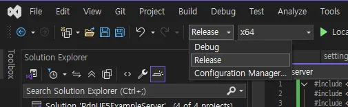
        
   2. chat_server와 game_server 프로젝트를 각각 빌드합니다.
   3. 솔루션의 하위 폴더에서 빌드된 실행파일을 확인할 수 있습니다.
        
      
        
2. 클라이언트 실행 파일 빌드
   1. 언리얼 에디터의 레벨 실행 옆 버튼을 통해 언리얼 프로젝트를 빌드할 수 있습니다.
        
      
        
   2. 지정한 경로를 통해 빌드된 파일을 확인할 수 있습니다.

   

### 6.3. 테스트

1. 서버 프로젝트에서 빌드 된 chat_server.exe와 game_server.exe를 실행합니다.
2. 언리얼 프로젝트에서 빌드 된 Windows 폴더의 PdnUE5ExampleClient.exe를 실행합니다.
    
   PC의 사양에 따라 컴퓨터에 심한 부하가 걸릴 수 있으므로 주의해야합니다.
    
3. 채팅 서버와 게임 서버를 이용하는 두 클라이언트의 모습을 확인할 수 있습니다.
    
   

---
